# Cara-Core Informática

Sistema completo de autenticação OAuth 2.1 + OIDC com controle de acesso granular para área restrita corporativa.

## Sobre o Projeto

O projeto Cara-Core é uma implementação completa de sistema de autenticação e autorização baseado em OAuth 2.1 e OpenID Connect (OIDC). O sistema oferece controle de acesso granular para área restrita, dashboard administrativo e integração com provedores OAuth populares.

**Status:** Produção estável  
**Versão:** 1.0.0  
**Ambiente:** [https://caracore-backend-docker.azurewebsites.net]  
**Frontend:** [https://www.caracore.com.br]

## Características Principais

### Sistema de Autenticação

- **OAuth 2.1 + OIDC:** Implementação completa conforme especificações
- **PKCE Obrigatório:** Todos os fluxos usam Proof Key for Code Exchange
- **Múltiplos Provedores:** Google OAuth e Microsoft Entra ID
- **Tokens JWT:** Validação completa (issuer, audience, expiração)
- **Logout Federado:** Limpeza segura de sessões

### Sistema de Autorização

- **Controle Granular:** Usuários, roles e permissões
- **Dashboard Administrativo:** Interface completa para gestão
- **API REST:** 4 endpoints para operações CRUD
- **Solicitação de Acesso:** Formulário integrado com aprovação
- **Auditoria Completa:** Logs estruturados de todas as operações

### Infraestrutura

- **Docker Production:** Azure Container Registry
- **CI/CD:** GitHub Actions automatizado
- **Monitoramento:** Azure Application Insights
- **Backup Automático:** Sistema de backup antes de atualizações
- **Health Checks:** Monitoramento de saúde da aplicação

## Índice

- [Cara-Core Informática](#cara-core-informática)
  - [Sobre o Projeto](#sobre-o-projeto)
  - [Características Principais](#características-principais)
    - [Sistema de Autenticação](#sistema-de-autenticação)
    - [Sistema de Autorização](#sistema-de-autorização)
    - [Infraestrutura](#infraestrutura)
  - [Índice](#índice)
  - [Documentação Técnica](#documentação-técnica)
    - [Site Corporativo](#site-corporativo)
    - [Deploy e Operações](#deploy-e-operações)
    - [Scripts Python](#scripts-python)
    - [Fases do Projeto](#fases-do-projeto)
    - [Status e Progresso](#status-e-progresso)
    - [Sistema de Autenticação (OIDC)](#sistema-de-autenticação-oidc)
  - [Conteúdo do Site - Visão Geral](#conteúdo-do-site---visão-geral)
    - [Visual da Página Principal](#visual-da-página-principal)
    - [Visual da Página de Login - Área 51](#visual-da-página-de-login---área-51)
      - [Diagrama Mermaid do fluxo OIDC da Área 51](#diagrama-mermaid-do-fluxo-oidc-da-área-51)
      - [Log de Console do OIDC da Área 51](#log-de-console-do-oidc-da-área-51)
    - [Serviços Oferecidos](#serviços-oferecidos)
    - [Área de Segurança](#área-de-segurança)
    - [Materiais Digitais e Apostilas](#materiais-digitais-e-apostilas)
    - [Estrutura do Repositório](#estrutura-do-repositório)
  - [Área 51 (Visão Geral)](#área-51-visão-geral)
  - [Como Visualizar](#como-visualizar)
  - [Observações](#observações)
  - [Contato](#contato)
  - [Detalhes Técnicos](#detalhes-técnicos)
    - [Sistema de Autenticação OIDC](#sistema-de-autenticação-oidc-1)
      - [Características Principais](#características-principais-1)
      - [Páginas e Endpoints](#páginas-e-endpoints)
      - [Documentação Complementar](#documentação-complementar)
    - [Configuração dos Provedores OIDC](#configuração-dos-provedores-oidc)
      - [Redirect URIs Essenciais](#redirect-uris-essenciais)
      - [Microsoft Entra ID (Azure)](#microsoft-entra-id-azure)
      - [Google OAuth (Gmail)](#google-oauth-gmail)
      - [Verificação da Configuração](#verificação-da-configuração)
    - [Fluxo de Autenticação](#fluxo-de-autenticação)
      - [Sequência do Fluxo OAuth 2.1 + PKCE](#sequência-do-fluxo-oauth-21--pkce)
      - [Configuração Personalizada](#configuração-personalizada)
      - [Persistência de Sessão](#persistência-de-sessão)
    - [Desenvolvimento Local](#desenvolvimento-local)
      - [Requisitos](#requisitos)
      - [1. Ambiente Virtual Python](#1-ambiente-virtual-python)
      - [2. Configuração do Backend](#2-configuração-do-backend)
      - [3. Executar o Ambiente](#3-executar-o-ambiente)
      - [4. Verificação do Ambiente](#4-verificação-do-ambiente)
      - [5. Testes Automatizados](#5-testes-automatizados)
      - [6. Troubleshooting](#6-troubleshooting)
    - [Backend Flask (Azure App Service)](#backend-flask-azure-app-service)
      - [Empacotamento para Deploy](#empacotamento-para-deploy)
        - [Método Recomendado: Docker (Linux-compatible)](#método-recomendado-docker-linux-compatible)
        - [Método Alternativo: Utilitário Cross-platform](#método-alternativo-utilitário-cross-platform)
    - [Deploy no Azure](#deploy-no-azure)
    - [Monitoramento e Logs](#monitoramento-e-logs)
      - [Logs Estruturados (Área 51)](#logs-estruturados-área-51)
    - [Troubleshooting](#troubleshooting)
      - [Resolvendo "redirect\_uri is not valid"](#resolvendo-redirect_uri-is-not-valid)
      - [Erro "authority mismatch" (Microsoft Entra)](#erro-authority-mismatch-microsoft-entra)
      - [Verificar Configuração Google Cloud Console](#verificar-configuração-google-cloud-console)
      - [Verificar Configuração Microsoft Azure/Entra](#verificar-configuração-microsoft-azureentra)
    - [Ferramentas e Utilitários](#ferramentas-e-utilitários)
      - [Compilar Scripts Python em Executáveis](#compilar-scripts-python-em-executáveis)
      - [Compilando `monitor_exe.py`](#compilando-monitor_exepy)
      - [Compilando `get_wi_fi.py`](#compilando-get_wi_fipy)

---

## Documentação Técnica

> **Índice Completo:** [docs/INDEX.md](docs/INDEX.md) - Navegue por toda a documentação do projeto

### Site Corporativo

- **[Portfolio](docs/PORTFOLIO_README.md)** - Documentação da página de portfólio
- **[Área 51 no Portfolio](docs/AREA51_PORTFOLIO.md)** - Implementação do projeto Área 51
- **[Google Analytics](docs/GOOGLE_ANALYTICS.md)** - Configuração completa GA4
- **[Analytics - Resumo](docs/GA_RESUMO.md)** - Resumo executivo da implementação
- **[Migração de Imagens](docs/MIGRACAO_IMAGENS.md)** - Reorganização da estrutura de assets

### Deploy e Operações

- **[Guia de Deploy Azure](docs/AZURE_DEPLOY.md)** - Deploy, rollback e troubleshooting completo
- **[Versões de Dependências](docs/VERSOES.md)** - Python, Flask, Gunicorn e todas as dependências
- **[Azure Monitor](docs/AZURE_MONITOR.md)** - Monitoramento e observabilidade no Azure
- **[GitHub Actions Setup](docs/GITHUB_ACTIONS_SETUP.md)** - Configuração de CI/CD
- **[Status de Deploy](docs/DEPLOY_STATUS_GITHUB_ACTIONS.md)** - Status das pipelines

**Scripts Automatizados:**

```powershell
# Deploy para produção
python scripts/deploy_production.py

# Rollback em emergência
python scripts/rollback.py --latest

# Listar backups disponíveis
python scripts/rollback.py --list
```

### Scripts Python

- **[Inventário de Scripts Python](scripts/README_PY.md)** - Documentação completa de todos os scripts
- **[Execução Rápida](run_script.py)** - Use `python run_script.py list` para listar scripts disponíveis

### Fases do Projeto

- **[Fase 1: OAuth 2.1 + OIDC](docs/fases/fase-1/)** - Fundação da autenticação (100% completo)
- **[Fase 2: Logout e Segurança](docs/fases/fase-2/)** - Melhorias de segurança (100% completo)
- **[Fase 3: Auditoria e Backend](docs/fases/fase-3/)** - Logs e observabilidade (90% completo)
- **[Fase 4: Monitoramento](docs/fases/fase-4/)** - Monitoramento avançado (planejado)

### Status e Progresso

- **[Status Atual do Projeto](docs/pendencias/STATUS-ATUAL.md)** - Progresso detalhado de todas as fases
- **[Critérios de Aceite OAuth 2.1](docs/pendencias/CRITERIOS-DE-ACEITE-OAUTH_2.1-OIDC.md)** - Critérios de validação
- **[Fase Cadastro](docs/pendencias/FASE-CADASTRO.md)** - Enumeração da Fase 4

### Sistema de Autenticação (OIDC)

A documentação completa do sistema de autenticação OAuth 2.1 + OIDC está organizada por fases:

- **[Fase 1: OAuth 2.1 + OIDC](docs/fases/fase-1/)** - Implementação base (100% completo)
- **[Fase 2: Logout e Segurança](docs/fases/fase-2/)** - Melhorias de segurança (100% completo)
- **[Fase 3: Auditoria e Logs](docs/fases/fase-3/)** - Sistema de logging estruturado (90% completo)

**Documentação de Referência:**

- **[Critérios de Aceite OAuth 2.1](docs/pendencias/CRITERIOS-DE-ACEITE-OAUTH_2.1-OIDC.md)** - Critérios de validação completos
- **[Status Atual](docs/pendencias/STATUS-ATUAL.md)** - Estado detalhado do sistema
- **[secure/README.md](secure/README.md)** - Documentação técnica da Área 51

---

## Conteúdo do Site - Visão Geral

O site destaca os principais serviços da empresa, reúne materiais para demonstrações comerciais e disponibiliza ferramentas internas de segurança. Todo o conteúdo público é estático e otimizado para navegação rápida, enquanto a Área 51 oferece autenticação OIDC para entregar informações confidenciais com controle de acesso contínuo.

### Visual da Página Principal


### Visual da Página de Login - Área 51


---

_O diagrama detalha o fluxo Authorization Code + PKCE, páginas estáticas e callbacks, e os pontos de configuração nos provedores._

#### Diagrama Mermaid do fluxo OIDC da Área 51

```mermaid
sequenceDiagram
   autonumber
   participant U as Usuário
   participant I as /secure/index.html
   participant P as Provedor (Google/Microsoft)
   participant C as /secure/callback.html
   participant R as /secure/restrita.html
   participant L as /secure/logout.html
   participant Bk as Backend (opcional)

   U->>I: Abrir página e escolher provedor
   I->>P: Autorizar (response_type=code, code_challenge, redirect_uri=/secure/callback.html)
   P-->>C: Redirect com code + state

   alt Troca de token no navegador
      C->>P: POST /token (code + code_verifier)
      P-->>C: id_token + access_token
   else Via backend (opcional)
      C->>+Bk: POST /token (code + code_verifier)
      Bk->>P: POST /token
      P-->>Bk: tokens
      Bk-->>-C: tokens
   end

   C->>R: Redireciona usuário autenticado
   U->>L: Logout
   L->>P: end_session (se aplicável)
   P-->>I: Redirect final (/index.html)
```



---

#### Log de Console do OIDC da Área 51


---

### Serviços Oferecidos

- **Consultoria Microsoft 365:** implantação, migração, governança e treinamento.
- **Automação com Python:** integrações, geração de relatórios e melhoria de processos.
- **Desenvolvimento de Sites:** sites institucionais, portfólios, blogs e landing pages responsivas.
- **Suporte Técnico:** backup, antivírus, segurança da informação e orientação tecnológica.
- **Segurança Digital:** proteção de dados, firewall, monitoramento e respostas a incidentes.
- **Treinamentos:** Microsoft 365, Excel, Python e produtividade digital.

### Área de Segurança

Ferramentas internas para auditoria e monitoramento em ambientes Windows:

- `security/monitor_exe.py`: monitora, em tempo real, conexões de rede de todos os processos.
- `wi_fi/get_wi_fi.py`: lista redes Wi-Fi salvas e respectivas senhas para fins de inventário.

As duas soluções ajudam a identificar acessos suspeitos, documentar atividades e reforçar políticas de segurança.

### Materiais Digitais e Apostilas

- `folders/folder_py.html`: folder digital com exportação para PDF (ideal para apresentações comerciais).
- Pasta `handbook/`: manuais, apostilas e scripts de conversão para HTML responsivo, incluindo o HANDBOOK e o SERVICEGUIDE.

### Estrutura do Repositório

```text
cara-core/
├── index.html                  # Página principal do site
├── planos.html                 # Página de planos e serviços
├── 404.html                    # Página de erro 404
├── CNAME                       # Configuração de domínio customizado
├── _config.yml                 # Configuração Jekyll (GitHub Pages)
├── _redirects                  # Regras de redirecionamento
├── vercel.json                 # Configuração Vercel (opcional)
├── package.json                # Dependências Node.js (se aplicável)
├── requirements.txt            # Dependências Python do projeto
├── run_script.py               # Launcher de scripts Python (executa scripts/)
├── README.md                   # Este arquivo
├── LICENSE                     # Licença de uso
│
├── area51/                     # Documentação complementar
│   └── wiki/                   # Wiki da Área 51
│       ├── index.html          # Página principal da wiki
│       └── assets/             # Recursos da wiki (CSS, JS, imagens)
│
├── secure/                     # Área 51 (páginas autenticadas)
│   ├── index.html              # Página de login OIDC
│   ├── callback.html           # Callback OAuth 2.1
│   ├── restrita.html           # Área restrita (pós-autenticação)
│   ├── logout.html             # Página de logout
│   ├── admin-logs.html         # Painel de logs (admin)
│   ├── auth-standalone.js      # Lógica de autenticação
│   ├── dynamic-config.js       # Configuração dinâmica de endpoints
│   ├── log-config.js           # Configuração de logging
│   └── README.md               # Documentação da Área 51
│
├── backend/                    # API Flask (Azure App Service)
│   ├── app.py                  # Aplicação Flask principal
│   ├── requirements.txt        # Dependências Python do backend
│   ├── .env.example            # Template de variáveis de ambiente
│   ├── allowlist.json          # Controle de acesso (whitelist)
│   ├── oryx-build-commands.txt # Comandos de build Oryx (Azure)
│   ├── logs/                   # Logs estruturados (*.jsonl)
│   └── data/                   # Dados JSON (se aplicável)
│
├── docker/                     # Configuração Docker
│   ├── Dockerfile              # Imagem Docker do backend
│   ├── docker-compose.yml      # Orquestração de containers
│   ├── docker-entrypoint.sh    # Script de inicialização
│   └── backend.env.sample      # Template de variáveis Docker
│
├── scripts/                                # Scripts de automação e deploy
│   ├── README_PY.md                        # Documentação completa dos scripts
│   ├── server.py                           # Servidor local de desenvolvimento
│   ├── teste.py                            # Testes do site estático
│   ├── deploy_to_azure.py                  # Deploy manual para Azure
│   ├── deploy_production.py                # Deploy automatizado com backup
│   ├── rollback.py                         # Rollback de versões
│   ├── package_backend_with_docker.py      # Empacotamento Docker
│   ├── executar_ut_secure.py               # Testes unitários OIDC
│   ├── verificar_backend_azure_simples.py  # Verificação Azure
│   ├── verificar_producao.py               # Diagnóstico completo produção
│   ├── configurar_backend_azure.py         # Configuração Azure
│   └── backend.zip                         # Pacote gerado para deploy
│
├── docs/                                # Documentação técnica completa
│   ├── INDEX.md                         # Índice geral da documentação
│   ├── AZURE_DEPLOY.md                  # Guia de deploy Azure
│   ├── AZURE_MONITOR.md                 # Monitoramento e observabilidade
│   ├── VERSOES.md                       # Versões de dependências
│   ├── GITHUB_ACTIONS_SETUP.md          # Configuração CI/CD
│   ├── DEPLOY_STATUS_GITHUB_ACTIONS.md  # Status pipelines
│   ├── fases/                           # Documentação por fase
│   │   ├── README.md                    # Visão geral das fases
│   │   ├── fase-1/                      # Fase 1: OAuth 2.1 + OIDC (100%)
│   │   ├── fase-2/                      # Fase 2: Logout e Segurança (100%)
│   │   ├── fase-3/                      # Fase 3: Auditoria e Backend (90%)
│   │   └── fase-4/                      # Fase 4: Monitoramento (planejado)
│   ├── pendencias/                      # Status e pendências
│   │   ├── STATUS-ATUAL.md              # Status detalhado do projeto
│   │   ├── FASE-CADASTRO.md             # Enumeração Fase 4
│   │   └── CRITERIOS-DE-ACEITE-OAUTH_2.1-OIDC.md
│   └── img/                             # Imagens da documentação
│
├── css/                        # Folhas de estilo CSS
│   └── additional-styles.css   # Estilos customizados
│
├── js/                         # Scripts JavaScript públicos
│   ├── analytics.js            # Google Analytics
│   ├── config.js               # Configuração geral
│   ├── config-local.js         # Configuração local
│   ├── logging.js              # Sistema de logs
│   ├── oidc.js                 # Utilitários OIDC
│   ├── html2pdf.bundle.min.js  # Geração de PDFs
│   └── vendor/                 # Bibliotecas de terceiros
│
├── images/                     # Imagens e logotipos do site
├── fonts/                      # Fontes customizadas
│
├── folders/                    # Materiais comerciais
│   ├── folder_py.html          # Folder digital exportável
│   └── apresentacao.md         # Apresentação institucional
│
├── handbook/                   # Apostilas e manuais
│   ├── HANDBOOK.md             # Apostila Microsoft 365 (fonte)
│   ├── HANDBOOK.html           # Apostila convertida
│   ├── HANDBOOK.py             # Script de conversão
│   ├── SERVICEGUIDE.md         # Manual de serviços (fonte)
│   ├── SERVICEGUIDE.html       # Manual convertido
│   ├── SERVICEGUIDE.py         # Script de conversão
│   ├── images/                 # Imagens dos manuais
│   ├── business_plan/          # Planos de negócio
│   └── README.md               # Documentação do handbook
│
├── security/                   # Ferramentas de segurança
│   └── monitor_exe.py          # Monitor de conexões de rede
│
├── wi_fi/                      # Utilitários Wi-Fi
│   └── get_wi_fi.py            # Listagem de redes Wi-Fi salvas
│
├── cv/                         # Currículos e portfólio
│   ├── server.py               # Servidor de desenvolvimento CV
│   ├── public/                 # Arquivos públicos CV
│   └── README.md               # Documentação CV
│
├── personal/                   # Página pessoal
│   ├── index.html              # Página principal pessoal
│   └── articles/               # Artigos e posts
│
├── politica/                   # Políticas e termos
│   ├── politica-privacidade.html
│   └── termos-servico.html
│
├── publications/               # Publicações e papers
├── log/                        # Logs de execução de scripts
└── deploy_temp/                # Arquivos temporários de deploy
```

---

## Área 51 (Visão Geral)

A Área 51 é a seção restrita do site, voltada a clientes, parceiros e ações internas. Ela oferece:

- **Autenticação via OIDC** (Microsoft e Google) com fluxo Authorization Code + PKCE.
- **Experiência consistente e local:** as páginas `secure/index.html`, `secure/callback.html`, `secure/restrita.html` e `secure/logout.html` utilizam sprite SVG, navegação responsiva e apenas arquivos CSS/JS hospedados no próprio domínio.
- **Controle por allowlist:** o arquivo `backend/allowlist.json` define quem pode acessar.

| Página | Descrição |
|--------|-----------|
| `/secure/index.html` | Tela de login com seleção de provedores |
| `/secure/callback.html` | Callback dedicado que processa o retorno do provedor e conduz à área restrita |
| `/secure/restrita.html` | Área autenticada com conteúdos exclusivos |
| `/secure/logout.html` | Confirmação de saída com recomendações de acesso |

A administração pode acompanhar eventos em tempo real pela página `secure/admin-logs.html`.

---

## Como Visualizar

1. Clone o repositório:

   ```sh
   git clone https://caracore.com.br/
   ```

2. Abra a pasta no VS Code (ou editor de sua preferência).

3. Abra `index.html` no navegador para navegar pelas páginas públicas.

4. Acesse `/secure/` para visualizar a Área 51 (é exibido o fluxo de login, mesmo sem backend ativo).

---

## Observações

- Para uso comercial da fonte Bellerose, adquira a licença em [harristype.com](https://www.harristype.com/font_store/bellerose_pro_family/bellerosefamily.html).
- Valores de planos e pacotes são referências e podem ser personalizados para cada projeto.

---

## Contato

- WhatsApp: [41 9 9909-7797](https://wa.me/5541999097797)
- E-mail: [suporte@caracore.com.br](mailto:suporte@caracore.com.br)
- [Facebook](https://www.facebook.com/caracoreinformatica/)
- [YouTube](https://www.youtube.com/@caracoreinformatica7704)
- [LinkedIn](https://pt.linkedin.com/company/cara-core)
- [GitHub](https://caracore.com.br/ecosistema.html)
- [Site](https://caracore.com.br)

---

## Detalhes Técnicos

Esta seção contém informações técnicas detalhadas sobre configuração, desenvolvimento e deploy do sistema. O conteúdo está organizado em ordem lógica de implementação: autenticação, configuração, desenvolvimento, deploy e troubleshooting.

### Sistema de Autenticação OIDC

O projeto implementa OAuth 2.1 + OIDC (OpenID Connect) com Authorization Code Flow + PKCE para máxima segurança.

#### Características Principais

- **Múltiplos provedores:** Microsoft Entra ID e Google Identity Platform
- **Segurança:** Authorization Code Flow + PKCE, cookies `HttpOnly`, `Secure` e `SameSite=Strict`
- **Logs estruturados:** eventos em JSON com sanitização de dados sensíveis
- **Proxy de token inteligente:** roteamento automático entre desenvolvimento e produção
- **Persistência de provedor:** gerenciamento de sessão com `sessionStorage`/`localStorage`
- **Interface responsiva:** componentes próprios sem dependências de CDN
- **Layout unificado:** sprite SVG compartilhado entre todas as páginas da Área 51

#### Páginas e Endpoints

| URL | Descrição | Função |
|-----|-----------|--------|
| `/secure/index.html` | Página de login | Seleção de provedor OAuth |
| `/secure/callback.html` | Callback OIDC | Processamento do authorization code |
| `/secure/restrita.html` | Área autenticada | Conteúdo restrito pós-login |
| `/secure/logout.html` | Logout | Encerramento de sessão |
| `/secure/admin-logs.html` | Painel admin | Visualização de logs em tempo real |

#### Documentação Complementar

- **[secure/README.md](secure/README.md)** - Documentação completa da Área 51
- **[Status Atual](docs/pendencias/STATUS-ATUAL.md)** - Estado detalhado do sistema
- **[Fase 1: OAuth 2.1](docs/fases/fase-1/)** - Implementação base da autenticação
- **[Fase 2: Segurança](docs/fases/fase-2/)** - Melhorias de segurança e logout
- **[Fase 3: Auditoria](docs/fases/fase-3/)** - Logs estruturados e observabilidade

### Configuração dos Provedores OIDC

#### Redirect URIs Essenciais

**Frontend (páginas estáticas):**

- `http://localhost:8000/secure/callback.html` (desenvolvimento local)
- `http://127.0.0.1:8000/secure/callback.html` (desenvolvimento local alternativo)
- `https://caracore.com.br/secure/callback.html` (GitHub Pages preview)
- `https://www.caracore.com.br/secure/callback.html` (produção)

**Backend (quando em uso):**

- `http://localhost:5051/secure/` (desenvolvimento)
- Domínio público do Azure App Service (produção)

#### Microsoft Entra ID (Azure)

**Configuração no Azure Portal:**

1. Acesse [Azure Portal - App Registrations](https://portal.azure.com/#view/Microsoft_AAD_RegisteredApps/ApplicationsListBlade)
2. Crie ou localize o App Registration: Client ID `8ef17663-438f-4777-99ca-c5ad5b2a2993`
3. Configure **Authentication > Web platform**:
   - Adicione as Redirect URIs listadas acima
4. Configure **API permissions**:
   - `openid` (delegated)
   - `profile` (delegated)
   - `email` (delegated)
5. Preencha `backend/.env`:

   ```env
   TENANT_ID=seu-tenant-id
   CLIENT_ID=8ef17663-438f-4777-99ca-c5ad5b2a2993
   CLIENT_SECRET=seu-client-secret
   ```

**Documentação complementar:**

- [Fase 1: OAuth 2.1 + OIDC](docs/fases/fase-1/) - Implementação base
- [Fase 2: Segurança](docs/fases/fase-2/) - Configuração de provedores
- [Critérios de Aceite](docs/pendencias/CRITERIOS-DE-ACEITE-OAUTH_2.1-OIDC.md) - Validação completa

#### Google OAuth (Gmail)

**Configuração no Google Cloud Console:**

1. Acesse [Google Cloud Console - Credentials](https://console.cloud.google.com/apis/credentials?project=chmulato-web-oauth2)
2. Localize o OAuth 2.0 Client ID: `1023942712021-7k4aalpg2oeenhisln9tk9s15m26iruu.apps.googleusercontent.com`
3. Configure **Authorized JavaScript origins**:
   - `https://www.caracore.com.br`
   - `http://localhost:8000` (desenvolvimento)
4. Configure **Authorized redirect URIs**:
   - Adicione todas as URIs listadas acima
5. Configure os escopos: `openid profile email`
6. Preencha `backend/.env`:

   ```env
   GOOGLE_CLIENT_ID=1023942712021-7k4aalpg2oeenhisln9tk9s15m26iruu.apps.googleusercontent.com
   GOOGLE_CLIENT_SECRET=seu-google-client-secret
   GOOGLE_ALLOWED_DOMAINS=example.com,anotherdomain.com
   ```

**Documentação complementar:**

- [Fase 1: OAuth 2.1 + OIDC](docs/fases/fase-1/) - Implementação base
- [Fase 2: Segurança](docs/fases/fase-2/) - Configuração de provedores
- [Critérios de Aceite](docs/pendencias/CRITERIOS-DE-ACEITE-OAUTH_2.1-OIDC.md) - Validação completa

#### Verificação da Configuração

```powershell
# 1. Inicie o backend
cd backend
python app.py

# 2. Em outro terminal, inicie o servidor estático
python server.py

# 3. Acesse o ambiente local
# http://localhost:8080/secure/

# 4. Teste o fluxo de autenticação com ambos os provedores
```

**Checklist de verificação:**

- [ ] Redirect URIs cadastradas em ambos os provedores
- [ ] Variáveis de ambiente configuradas no `backend/.env`
- [ ] Backend respondendo em `/health`
- [ ] Site estático acessível
- [ ] Login Google funcional
- [ ] Login Microsoft funcional
- [ ] Logs sendo gravados corretamente

### Fluxo de Autenticação

#### Sequência do Fluxo OAuth 2.1 + PKCE

1. **Login:** usuário acessa `/secure/index.html` e escolhe provedor (Google ou Microsoft)
2. **Autorização:** redirecionamento para o provedor com `code_challenge` (PKCE)
3. **Callback:** provedor retorna para `/secure/callback.html` com authorization code
4. **Troca de tokens:** `auth-standalone.js` troca code por tokens usando `code_verifier`
5. **Acesso:** usuário é redirecionado para `/secure/restrita.html` autenticado
6. **Logout:** via `/secure/logout.html` com encerramento de sessão no provedor

#### Configuração Personalizada

O arquivo `secure/dynamic-config.js` gera os caminhos automaticamente usando `resolveOidcPaths()`.

**Personalizar endpoints:**

```html
<script>
   window.CARA_CORE_CONFIG = {
      oidcPaths: {
         callback: '/secure/custom-callback.html',
         logout: '/secure/custom-logout.html'
      }
   };
</script>
```

**Personalizar backend:**

```html
<script>
   window.CARA_CORE_CONFIG = {
      backendBaseUrl: 'https://api-suaempresa.azurewebsites.net',
      // Opcional: definir manualmente o endpoint de token
      googleTokenEndpoint: 'https://api-suaempresa.azurewebsites.net/oauth/google/token'
   };
</script>
```

#### Persistência de Sessão

O sistema utiliza `sessionStorage` (com fallback para `localStorage`) para manter o provedor selecionado, evitando erros de "authority mismatch".

**Trocar de provedor durante testes:**

```javascript
// Limpar provedor armazenado
window.sessionStorage.removeItem('cara_core_oidc_provider');
window.localStorage.removeItem('cara_core_oidc_provider');

// Ou selecionar explicitamente o provedor desejado na UI
```

**Importante:** Os provedores devem ter `/secure/callback.html` obrigatoriamente cadastrado nas Redirect URIs.

### Desenvolvimento Local

Guia completo para configurar o ambiente de desenvolvimento no Windows usando PowerShell e VS Code.

#### Requisitos

- Windows 10/11
- Python 3.11 ou superior
- VS Code
- Docker Desktop (opcional, para backend em container)
- PowerShell 5.1 ou superior

#### 1. Ambiente Virtual Python

Crie e ative um ambiente virtual (recomendado):

```powershell
# Criar ambiente virtual
python -m venv .venv

# Ativar ambiente virtual
.\.venv\Scripts\Activate.ps1

# Atualizar pip
python -m pip install --upgrade pip

# Instalar dependências
python -m pip install -r requirements.txt
```

**Nota:** Se o launcher da Microsoft Store interferir, use `py -3.13` no lugar de `python`.

#### 2. Configuração do Backend

**Arquivo `.env` principal:**

```powershell
# Copiar template
Copy-Item backend\.env.example backend\.env

# Editar arquivo com suas credenciais
code backend\.env
```

Preencha as seguintes variáveis em `backend/.env`:

```env
# Microsoft Entra ID
TENANT_ID=seu-tenant-id
CLIENT_ID=8ef17663-438f-4777-99ca-c5ad5b2a2993
CLIENT_SECRET=seu-client-secret

# Google OAuth
GOOGLE_CLIENT_ID=1023942712021-7k4aalpg2oeenhisln9tk9s15m26iruu.apps.googleusercontent.com
GOOGLE_CLIENT_SECRET=seu-google-client-secret
GOOGLE_ALLOWED_DOMAINS=example.com,anotherdomain.com

# Cache e Segurança
JWKS_CACHE_TTL_SECONDS=3600
LOG_RETENTION_DAYS=30
```

**Arquivo Docker (opcional):**

Se for usar Docker para o backend:

```powershell
# Copiar template Docker
Copy-Item docker\backend.env.sample docker\backend.env

# Editar arquivo
code docker\backend.env
```

#### 3. Executar o Ambiente

**[Opção A]: Via VS Code Tasks (Recomendado)**

Use os atalhos do VS Code:

- **F5** ou `Run root server.py`: Inicia site estático + backend Docker
- `Run area51 app.py`: Sobe apenas o backend Flask
- `Test: site + area51 link`: Testa o link da Área 51

**[Opção B]: Via PowerShell Manual**

**Servidor estático + Backend Docker:**

```powershell
# Na raiz do projeto
python server.py
```

O script automaticamente:

- Inicia Docker Desktop (se necessário)
- Sobe o backend via `docker compose`
- Serve o site estático em [http://localhost:8080]

Para desabilitar o início automático do Docker:

```powershell
$env:AUTO_START_DOCKER_BACKEND=0
python server.py
```

**Backend sem Docker:**

```powershell
# Executar Flask diretamente
cd backend
python app.py
```

O backend ficará disponível em http://localhost:5051

**Backend Docker manual:**

```powershell
cd docker
docker compose up -d backend
```

#### 4. Verificação do Ambiente

**Verificar serviços:**

```powershell
# Backend Health Check
curl http://localhost:5051/health

# Site estático
start http://localhost:8080

# Área 51
start http://localhost:8080/secure/
```

**Acessar URLs:**

- Site estático: [http://localhost:8080]
- Backend API: [http://localhost:5051]
- Área 51: [http://localhost:8080/secure/]
- Health Check: [http://localhost:5051/health]

#### 5. Testes Automatizados

**Teste do site estático:**

```powershell
python teste.py
```

Verifica: status 200, textos-chave, link "Área 51"

**Teste do backend local:**

```powershell
python teste_end_point_local.py
```

Verifica: `/health`, CORS, endpoints sem credenciais

**Teste do backend Azure:**

```powershell
# Com URL padrão
python teste_end_point_azure.py

# Com URL customizada
python teste_end_point_azure.py --base-url https://sua-api.azurewebsites.net
```

**Saída esperada:** Todas verificações marcadas como `OK` e mensagem final **"Todos os testes passaram."**

#### 6. Troubleshooting

**[Problema]: Python não encontrado**

```powershell
# Usar py launcher
py -3.13 --version

# Ou ajustar no VS Code
# settings.json: "python.defaultInterpreterPath": "C:\\Python313\\python.exe"
```

**[Problema]: Docker não inicia**

```powershell
# Verificar status do Docker
docker --version
docker ps

# Iniciar Docker Desktop manualmente
start "C:\Program Files\Docker\Docker\Docker Desktop.exe"
```

**[Problema]: Porta em uso**

```powershell
# Verificar porta 8080
netstat -ano | findstr :8080

# Encerrar processo (use o PID da saída acima)
taskkill /PID <PID> /F
```

**[Problema]: Módulos Python não encontrados**

```powershell
# Garantir que está no ambiente virtual
.\.venv\Scripts\Activate.ps1

# Reinstalar dependências
python -m pip install -r requirements.txt --force-reinstall
```

### Backend Flask (Azure App Service)

- O backend vive em `backend/app.py` e expõe dois endpoints: `/health` e `/oauth/google/token`.
- O serviço roda em produção com `gunicorn --chdir backend app:app` (definido no App Service).
- Variáveis sensíveis (ex.: `GOOGLE_CLIENT_SECRET`) são buscadas do Azure Key Vault via App Settings com referência `@Microsoft.KeyVault(SecretUri=...)`.
- Logs são estruturados em JSON e podem ser conferidos pelo **Log Stream** do App Service ou via `az webapp log tail`.
- O arquivo `backend/allowlist.json` controla quem pode concluir o login na Área 51.


#### Empacotamento para Deploy

##### Método Recomendado: Docker (Linux-compatible)

**Para garantir máxima compatibilidade com Azure App Service**, use o script que gera o pacote dentro de um contêiner Linux:

```powershell
python scripts/package_backend_with_docker.py
```

**Vantagens do método Docker:**

- **Compatibilidade total** com Azure App Service (Linux glibc)
- **Dependências nativas** compiladas para Linux amd64
- **Reprodutibilidade** entre diferentes sistemas operacionais
- **Automatização completa** do processo de empacotamento

**O que o script faz:**

1. **Cria contêiner** `python:3.11-bullseye` (mesma base do Azure)
2. **Instala dependências** em `backend/.python_packages` (Linux wheels)
3. **Gera `backend.zip`** pronto para deploy
4. **Logs detalhados** em `log/package_backend_YYYYMMDD_HHMMSS.log`

**Requisitos:**

- Docker Desktop ativo (Windows/macOS) ou Docker Engine (Linux)
- Comando `docker` disponível no PATH

**Opções avançadas:**

```powershell
# Especificar imagem Docker diferente
python scripts/package_backend_with_docker.py --docker-image python:3.12-slim

# Argumentos extras para pip
python scripts/package_backend_with_docker.py --pip-extra-arg="--no-cache-dir"

# Diretório backend customizado
python scripts/package_backend_with_docker.py --backend-dir="custom-backend"
```

**Troubleshooting Docker:**

- **Erro "docker command not found"**: Instale Docker Desktop ou verifique PATH
- **Erro de permissão**: Certifique-se que Docker Desktop está executando
- **Builds lentos**: O primeiro download da imagem `python:3.11-bullseye` pode demorar
- **Logs detalhados**: Sempre disponíveis em `log/package_backend_YYYYMMDD_HHMMSS.log`

##### Método Alternativo: Utilitário Cross-platform

Para casos simples ou quando Docker não estiver disponível:

```powershell
python package_backend.py --overwrite
```

**Quando usar cada método:**

- **Docker**: Deploy para produção, CI/CD, máxima compatibilidade
- **Cross-platform**: Desenvolvimento local, testes rápidos, sem Docker

O script gera `scripts/backend.zip` (na pasta scripts), removendo `logs/`, `__pycache__/` e arquivos compilados. Como alternativa manual, gere o pacote a partir de uma cópia limpa da pasta `backend/`, sem `logs/` ou `__pycache__/`.

**PowerShell (Windows):**

```powershell
Remove-Item -Force -ErrorAction SilentlyContinue scripts/backend.zip
Remove-Item -Recurse -Force -ErrorAction SilentlyContinue backend-deploy
robocopy backend backend-deploy /MIR /XD logs __pycache__
Compress-Archive -Path backend-deploy\* -DestinationPath scripts/backend.zip
Remove-Item -Recurse -Force backend-deploy
```

**bash (Linux/macOS):**

```bash
rm -f scripts/backend.zip
rm -rf backend-deploy
rsync -a backend/ backend-deploy/ --exclude logs --exclude __pycache__
(cd backend-deploy && zip -r ../scripts/backend.zip .)
rm -rf backend-deploy
```

> O zip precisa conter `app.py` e `requirements.txt` na raiz interna e já incluir `gunicorn` nas dependências.

Para validar rapidamente, execute `python teste_end_point_local.py` enquanto o contêiner Docker estiver ativo e, após o deploy, rode `python teste_end_point_azure.py` apontando para a URL pública do App Service.

### Deploy no Azure


1. Execute `py -3.13 .\deploy_to_azure.py` para provisionar/atualizar Resource Group, App Service Plan (Linux) e Web App (Python 3.11).
   - O script identifica Subscription/Tenant via `az account show` e pergunta se o segredo do Google deve ser salvo no Key Vault.
   - Use a opção `--store-google-secret` para criar a referência segura `@Microsoft.KeyVault(...)` diretamente no App Setting.
   - Para execução sem prompt, passe os parâmetros de linha de comando (`--resource-group`, `--app-name`, `--zip scripts/backend.zip`, etc.).
1. Após o deploy, reinicie o Web App se alterar App Settings críticos:

   ```powershell
   az webapp restart --resource-group <RG> --name <APP_NAME>
   ```

1. Valide o endpoint de saúde (`/health`) e realize um login completo pela Área 51 para confirmar a troca de tokens.
1. Acompanhe os logs em tempo real com `az webapp log tail --name <APP_NAME> --resource-group <RG>` e confirme os campos estruturados.
1. Crie um orçamento em **Azure Portal > Cost Management + Billing > Budgets** para receber alertas mensais de consumo.

> Dica: habilite **Run From Package** ou utilize **Deployment Slots** para fazer deploy sem downtime quando publicar novas versões do `backend.zip`.

### Monitoramento e Logs

#### Logs Estruturados (Área 51)

- O endpoint `/logs` aceita eventos JSON com campos autorizados (`ts`, `event`, `session_id`, etc.)
- Dados sensíveis (tokens, authorization codes, PII) são bloqueados tanto no cliente quanto no servidor
- `LOG_RETENTION_DAYS` controla a retenção; os arquivos ficam em `backend/logs/*.jsonl`
- Cookies de sessão seguem boas práticas (`HttpOnly`, `Secure`, `SameSite=Strict`)

**Visualizar logs:**

```powershell
# Logs locais
Get-Content backend\logs\*.jsonl -Tail 20

# Logs Azure (tempo real)
az webapp log tail --name <APP_NAME> --resource-group <RG>
```

### Troubleshooting

#### Resolvendo "redirect_uri is not valid"

Problemas comuns de configuração provocam erros "redirect_uri is not valid" (Google) ou `AADSTS9002346` (Microsoft). Ajuste conforme abaixo.

#### Erro "authority mismatch" (Microsoft Entra)

Esse erro indica que o callback retornou para um provedor diferente do usado no início do fluxo.

**Solução:**

1. Certifique-se de iniciar o login com o botão "Continuar com Microsoft"
2. Se estiver alternando entre Google e Entra no mesmo navegador, limpe o provedor armazenado:

   ```javascript
   window.sessionStorage.removeItem('cara_core_oidc_provider');
   window.localStorage.removeItem('cara_core_oidc_provider');
   ```

3. Garanta que a aplicação do Entra possui as Redirect URIs corretas cadastradas
4. Force o recarregamento (`Ctrl + F5`) para carregar o `auth-standalone.js` atualizado

#### Verificar Configuração Google Cloud Console

**Checklist de Redirect URIs:**

1. Acesse [Google Cloud Console – Credentials](https://console.cloud.google.com/apis/credentials?project=chmulato-web-oauth2)
2. Abra o OAuth 2.0 Client ID: `1023942712021-7k4aalpg2oeenhisln9tk9s15m26iruu.apps.googleusercontent.com`
3. Verifique **Authorized JavaScript origins**:
   - `https://www.caracore.com.br`
   - `http://localhost:8000` (desenvolvimento)
4. Verifique **Authorized redirect URIs**:
   - `http://localhost:8000/secure/callback.html`
   - `http://127.0.0.1:8000/secure/callback.html`
   - `https://caracore.com.br/secure/callback.html`
   - `https://www.caracore.com.br/secure/callback.html`
5. Salve e teste novamente

#### Verificar Configuração Microsoft Azure/Entra

**Checklist de Redirect URIs:**

1. Acesse [Azure Portal – App registrations](https://portal.azure.com/#view/Microsoft_AAD_RegisteredApps/ApplicationsListBlade)
2. Localize o app com Client ID `8ef17663-438f-4777-99ca-c5ad5b2a2993`
3. Em **Authentication > Platform configurations > Web**, verifique as Redirect URIs:
   - `http://localhost:8000/secure/callback.html`
   - `http://127.0.0.1:8000/secure/callback.html`
   - `https://caracore.com.br/secure/callback.html`
   - `https://www.caracore.com.br/secure/callback.html`
4. Salve e repita o login

### Ferramentas e Utilitários

#### Compilar Scripts Python em Executáveis

Se desejar distribuir as ferramentas internas em formato `.exe`, utilize o PyInstaller.

#### Compilando `monitor_exe.py`

1. Instale o PyInstaller:

   ```sh
   pip install pyinstaller
   ```

2. Gere o executável:

   ```sh
   pyinstaller --onefile monitor_exe.py
   ```

3. Para ocultar o console, use `pyinstaller --onefile --noconsole monitor_exe.py`.
4. O binário final estará em `dist/monitor_exe.exe`.

#### Compilando `get_wi_fi.py`

1. Instale o PyInstaller (se ainda não fez):

   ```sh
   pip install pyinstaller
   ```

2. Gere o executável:

   ```sh
   pyinstaller --onefile get_wi_fi.py
   ```

3. Para ocultar o console, utilize `pyinstaller --onefile --noconsole get_wi_fi.py`.
4. O executável estará em `dist/get_wi_fi.exe` — execute como administrador para listar senhas Wi-Fi.

---

Cara-Core Informática — soluções em tecnologia para o seu negócio.

