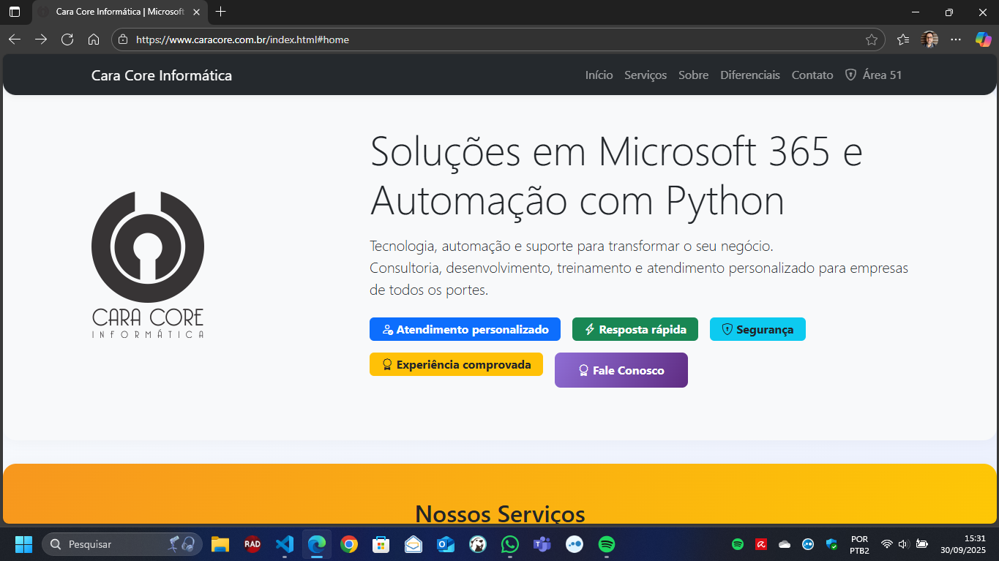
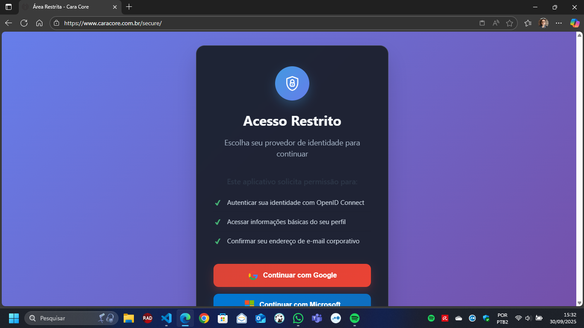
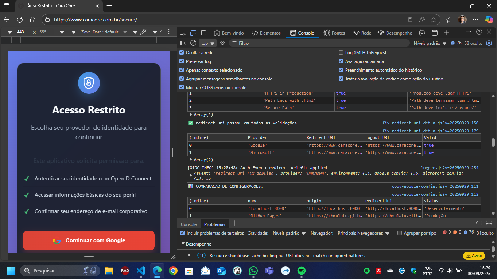
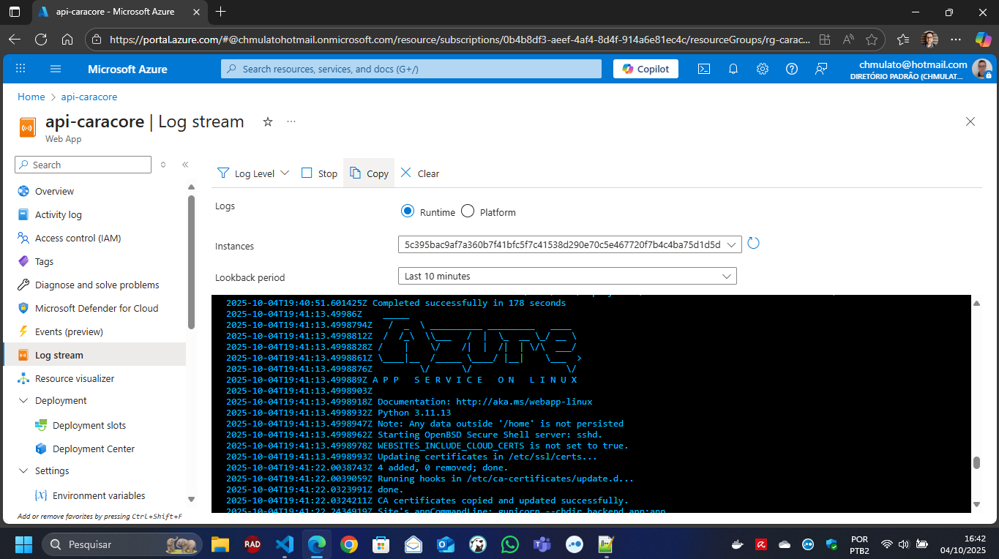
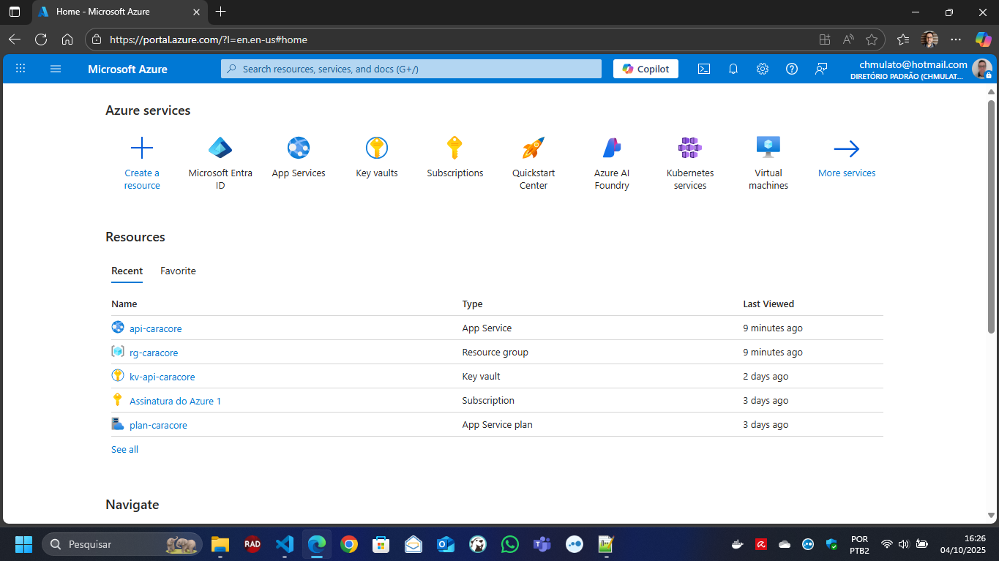

# Cara-Core Informática

Este repositório abriga o site institucional da **Cara-Core Informática**. Aqui você encontra as páginas públicas com serviços, materiais de apoio, apresentações comerciais e a Área 51 — a experiência de login restrito para clientes e parceiros.

## Índice

- [Cara-Core Informática](#cara-core-informática)
  - [Índice](#índice)
  - [Documentação Técnica](#documentação-técnica)
    - [Scripts Python](#scripts-python)
    - [Configuração e Deploy](#configuração-e-deploy)
    - [Testes e Validação](#testes-e-validação)
    - [Sistema de Autenticação (OIDC)](#sistema-de-autenticação-oidc)
    - [Arquitetura e Soluções](#arquitetura-e-soluções)
  - [Conteúdo do Site - Visão Geral](#conteúdo-do-site---visão-geral)
    - [Visual da Página Principal](#visual-da-página-principal)
    - [Visual da Página de Login - Área 51](#visual-da-página-de-login---área-51)
      - [Diagrama Mermaid do fluxo OIDC da Área 51](#diagrama-mermaid-do-fluxo-oidc-da-área-51)
      - [Log de Console do OIDC da Área 51](#log-de-console-do-oidc-da-área-51)
    - [Serviços Oferecidos](#serviços-oferecidos)
    - [Área de Segurança](#área-de-segurança)
    - [Materiais Digitais e Apostilas](#materiais-digitais-e-apostilas)
    - [Estrutura do Site](#estrutura-do-site)
  - [Área 51 (Visão Geral)](#área-51-visão-geral)
  - [Como Visualizar](#como-visualizar)
  - [Observações](#observações)
  - [Contato](#contato)
  - [Detalhes Técnicos](#detalhes-técnicos)
    - [Sistema de Autenticação OIDC](#sistema-de-autenticação-oidc-1)
      - [Documentação do Sistema de Autenticação](#documentação-do-sistema-de-autenticação)
    - [Configuração OIDC (Azure / Google)](#configuração-oidc-azure--google)
      - [Fluxo recomendado de redirecionamento](#fluxo-recomendado-de-redirecionamento)
      - [Persistência do provedor selecionado](#persistência-do-provedor-selecionado)
    - [Desenvolvimento Local (Windows/PowerShell + VS Code)](#desenvolvimento-local-windowspowershell--vs-code)
    - [Backend Flask (Azure App Service)](#backend-flask-azure-app-service)
      - [Gerar o pacote `backend.zip`](#gerar-o-pacote-backendzip)
      - [Método Recomendado: Docker (Linux-compatible)](#método-recomendado-docker-linux-compatible)
      - [Método Alternativo: Utilitário Cross-platform](#método-alternativo-utilitário-cross-platform)
    - [Deploy no Azure](#deploy-no-azure)
    - [Logs Seguros (Área 51)](#logs-seguros-área-51)
    - [Resolvendo "redirect\_uri is not valid"](#resolvendo-redirect_uri-is-not-valid)
      - [Erro `callback_failed&reason=authority mismatch` (Microsoft Entra)](#erro-callback_failedreasonauthority-mismatch-microsoft-entra)
      - [Google Cloud Console](#google-cloud-console)
      - [Microsoft Azure/Entra (App Registration)](#microsoft-azureentra-app-registration)
    - [Compilar Scripts Python em Executáveis](#compilar-scripts-python-em-executáveis)
      - [Compilando `monitor_exe.py`](#compilando-monitor_exepy)
      - [Compilando `get_wi_fi.py`](#compilando-get_wi_fipy)

---

## Documentação Técnica

### Scripts Python

- **[Inventário de Scripts Python](scripts/README_PY.md)** - Documentação completa de todos os scripts Python organizados na pasta `scripts/`
- **[Execução Rápida](run_script.py)** - Use `python run_script.py list` para ver todos os scripts disponíveis
- **[Testes Unitários OIDC](scripts/executar_ut_secure.py)** - Execute `python run_script.py executar_ut_secure.py --help` para opções
- **[Reorganização Scripts](docs/REORGANIZACAO_SCRIPTS_PYTHON.md)** - Documentação da migração e organização dos scripts Python

### Configuração e Deploy

- **[Arquitetura do Sistema](docs/ARQUITETURA.md)** - Visão geral da arquitetura técnica do projeto
- **[Guia de Deploy](docs/DEPLOY.md)** - Procedimentos para deploy em produção
- **[Status de Deploy](docs/DEPLOY-STATUS.md)** - Status atual do deploy e configurações
- **[Configuração de Redirect URIs](docs/CONFIGURACAO-REDIRECT-URIS.md)** - Guia para configurar URIs de redirecionamento
- **[Configuração Google Cloud](docs/GOOGLE-CLOUD-CONFIG.md)** - Configurações específicas do Google Cloud Console
- **[Logs de Produção](docs/LOG-PRODUCAO.md)** - Documentação sobre logs em ambiente de produção

### Testes e Validação

- **[Checklist OIDC Google](docs/CHECKLIST_OIDC_GOOGLE.md)** - Lista de verificação para configuração Google OAuth
- **[Checklist OIDC Entra ID](docs/CHECKLIST_OIDC_ENTRA.md)** - Lista de verificação para configuração Microsoft Entra ID

### Sistema de Autenticação (OIDC)

- **[Status Atual](docs/STATUS-ATUAL.md)** - Resumo do estado atual do sistema de autenticação
- **[Guia do Desenvolvedor - Auth](docs/GUIA-DESENVOLVEDOR-AUTH.md)** - Guia técnico para desenvolvedores trabalhando na autenticação
- **[Próximos Passos](docs/PROXIMOS-PASSOS.md)** - Próximas etapas recomendadas para evolução do sistema
- **[Pendências](docs/pendencias/PENDENCIAS.md)** - Lista categorizada de pendências em diferentes áreas
- **[Checklist de Segurança OIDC](docs/pendencias/CHECKLIST-SEGURANCA-OIDC.md)** - Checklist completo de segurança para OIDC
- **[Prioridades Técnicas Q4 2025](docs/pendencias/PRIORIDADES-TECNICAS-Q4-2025.md)** - Roadmap de prioridades técnicas
- **[Validação OIDC Google](docs/VALIDATED_OIDC_GOOGLE.md)** - Relatório de validação Google OAuth
- **[Validação OIDC Entra ID](docs/VALIDATED_OIDC_ENTRA_ID.md)** - Relatório de validação Microsoft Entra ID
- **[Validação Final Entra ID](docs/VALIDACAO_ENTRA_ID_FINAL.md)** - **Confirmação operacional: Portal Área 51 configurado apenas para contas pessoais Microsoft**
- **[Configuração Entra ID Contas Pessoais](docs/ENTRA_ID_CONTAS_PESSOAIS.md)** - Documentação técnica da configuração para contas pessoais
- **[Cobertura de Testes OIDC](docs/VALIDACAO_COBERTURA_TESTES_OIDC.md)** - **Validação automática de cobertura de testes unitários (94.1%)**
- **[Teste e Correção Microsoft](docs/TESTE-CORRECAO-MICROSOFT.md)** - Procedimentos de teste e correção Microsoft

### Arquitetura e Soluções

- **[Solução CaraCore](docs/SOLUCAO-CARACORE.md)** - Documentação da solução técnica implementada
- **[Solução Redirect URI](docs/SOLUCAO-REDIRECT-URI.md)** - Solução para problemas de Redirect URI
- **[Checklist do Projeto](docs/PROJECT-CHECKLIST.md)** - Lista geral de verificação do projeto

---

## Conteúdo do Site - Visão Geral

O site destaca os principais serviços da empresa, reúne materiais para demonstrações comerciais e disponibiliza ferramentas internas de segurança. Todo o conteúdo público é estático e otimizado para navegação rápida, enquanto a Área 51 oferece autenticação OIDC para entregar informações confidenciais com controle de acesso contínuo.

### Visual da Página Principal



### Visual da Página de Login - Área 51



---

_O diagrama detalha o fluxo Authorization Code + PKCE, páginas estáticas e callbacks, e os pontos de configuração nos provedores._

#### Diagrama Mermaid do fluxo OIDC da Área 51


---

#### Log de Console do OIDC da Área 51



---

### Serviços Oferecidos

- **Consultoria Microsoft 365:** implantação, migração, governança e treinamento.
- **Automação com Python:** integrações, geração de relatórios e melhoria de processos.
- **Desenvolvimento de Sites:** sites institucionais, portfólios, blogs e landing pages responsivas.
- **Suporte Técnico:** backup, antivírus, segurança da informação e orientação tecnológica.
- **Segurança Digital:** proteção de dados, firewall, monitoramento e respostas a incidentes.
- **Treinamentos:** Microsoft 365, Excel, Python e produtividade digital.

### Área de Segurança

Ferramentas internas para auditoria e monitoramento em ambientes Windows:

- `security/monitor_exe.py`: monitora, em tempo real, conexões de rede de todos os processos.
- `wi_fi/get_wi_fi.py`: lista redes Wi-Fi salvas e respectivas senhas para fins de inventário.

As duas soluções ajudam a identificar acessos suspeitos, documentar atividades e reforçar políticas de segurança.

### Materiais Digitais e Apostilas

- `folders/folder_py.html`: folder digital com exportação para PDF (ideal para apresentações comerciais).
- Pasta `handbook/`: manuais, apostilas e scripts de conversão para HTML responsivo, incluindo o HANDBOOK e o SERVICEGUIDE.

### Estrutura do Site

```text
cara-core/
├── index.html                  # Página principal do site
├── planos.html                 # Página de planos de desenvolvimento de sites
├── folders/
│   ├── folder_py.html          # Folder digital com opção de exportar para PDF
│   └── apresentacao.md         # Apresentação institucional em Markdown
├── images/                     # Imagens e logotipos utilizados no site
├── fonts/                      # Fontes utilizadas no site
├── js/                         # Scripts JavaScript utilizados no site
├── security/
│   └── monitor_exe.py          # Script de monitoramento de conexões de rede
├── wi_fi/
│   └── get_wi_fi.py            # Script para listar redes Wi-Fi salvas e senhas
├── handbook/                   # Apostilas, manuais e scripts de conversão para HTML
│   ├── HANDBOOK.md             # Apostila Microsoft 365 (editável)
│   ├── HANDBOOK.html           # Apostila convertida para HTML responsivo
│   ├── HANDBOOK.py             # Script para converter e ajustar a apostila
│   ├── SERVICEGUIDE.md         # Manual de serviços (editável)
│   ├── SERVICEGUIDE.html       # Manual de serviços convertido para HTML responsivo
│   ├── SERVICEGUIDE.py         # Script para converter e ajustar o manual de serviços
│   ├── images/                 # Imagens e anexos utilizados
│   └── README.md               # Documentação específica da pasta handbook
├── README.md                   # Este arquivo
└── LICENSE                     # Licença de uso
```

---

## Área 51 (Visão Geral)

A Área 51 é a seção restrita do site, voltada a clientes, parceiros e ações internas. Ela oferece:

- **Autenticação via OIDC** (Microsoft e Google) com fluxo Authorization Code + PKCE.
- **Experiência consistente e local:** as páginas `secure/index.html`, `secure/callback.html`, `secure/restrita.html` e `secure/logout.html` utilizam sprite SVG, navegação responsiva e apenas arquivos CSS/JS hospedados no próprio domínio.
- **Controle por allowlist:** o arquivo `backend/allowlist.json` define quem pode acessar.

| Página | Descrição |
|--------|-----------|
| `/secure/index.html` | Tela de login com seleção de provedores |
| `/secure/callback.html` | Callback dedicado que processa o retorno do provedor e conduz à área restrita |
| `/secure/restrita.html` | Área autenticada com conteúdos exclusivos |
| `/secure/logout.html` | Confirmação de saída com recomendações de acesso |

A administração pode acompanhar eventos em tempo real pela página `secure/admin-logs.html`.

---

## Como Visualizar

1. Clone o repositório:

   ```sh
   git clone https://github.com/chmulato/cara-core.git
   ```

2. Abra a pasta no VS Code (ou editor de sua preferência).

3. Abra `index.html` no navegador para navegar pelas páginas públicas.

4. Acesse `/secure/` para visualizar a Área 51 (é exibido o fluxo de login, mesmo sem backend ativo).

---

## Observações

- Para uso comercial da fonte Bellerose, adquira a licença em [harristype.com](https://www.harristype.com/font_store/bellerose_pro_family/bellerosefamily.html).
- Valores de planos e pacotes são referências e podem ser personalizados para cada projeto.

---

## Contato

- WhatsApp: [41 9 9909-7797](https://wa.me/5541999097797)
- E-mail: [suporte@caracore.com.br](mailto:suporte@caracore.com.br)
- [Facebook](https://www.facebook.com/caracoreinformatica/)
- [YouTube](https://www.youtube.com/@caracoreinformatica7704)
- [LinkedIn](https://pt.linkedin.com/company/cara-core)
- [GitHub](https://github.com/chmulato)
- [Site](https://caracore.com.br)

---

## Detalhes Técnicos

### Sistema de Autenticação OIDC

- **Múltiplos provedores:** Microsoft Entra ID e Google Identity Platform.
- **Segurança:** Authorization Code Flow + PKCE, cookies `HttpOnly`, `Secure` e `SameSite=Strict` (com exceções automáticas em desenvolvimento).
- **Logs estruturados:** eventos em JSON, enviados via POST para `/logs` com sanitização por allowlist.
- **Proxy de token inteligente:** `secure/log-config.js` aponta automaticamente o fluxo `/oauth/google/token` para `https://api-caracore.azurewebsites.net` em produção e utiliza `server.py` durante o desenvolvimento local. Para domínios alternativos, basta definir `window.CARA_CORE_CONFIG.backendBaseUrl` antes de carregar os scripts.
- **Persistência de provedor:** `secure/auth-standalone.js` grava o último provedor usado (Google/Entra) para garantir que o callback utilize a mesma authority. Após rotações de testes, limpe `sessionStorage`/`localStorage` ou selecione explicitamente outro provedor pelo botão da interface.
- **Interface responsiva:** componentes próprios, sem dependências de CDN.
- **Layout unificado:** as três páginas da Área 51 compartilham sprite SVG, menu responsivo e mesma paleta.

#### Documentação do Sistema de Autenticação

- **[Status Atual](docs/STATUS-ATUAL.md)** - Resumo do estado atual e correções implementadas
- **[Guia do Desenvolvedor](docs/GUIA-DESENVOLVEDOR-AUTH.md)** - Guia técnico detalhado para trabalhar com o sistema
- **[Checklist de Segurança](docs/pendencias/CHECKLIST-SEGURANCA-OIDC.md)** - Checklist para garantir segurança na implementação OIDC
- **[Correções Recentes](docs/pendencias/CORRECOES-AUTENTICACAO.md)** - Histórico de correções implementadas
- **[Próximos Passos](docs/PROXIMOS-PASSOS.md)** - Etapas recomendadas para evolução do sistema

| URL | Descrição |
|-----|-----------|
| `/secure/index.html` | Página de login principal |
| `/secure/callback.html` | Página intermediária que valida o retorno do provedor |
| `/secure/restrita.html` | Área restrita autenticada |
| `/secure/logout.html` | Página de logout |

Para documentação aprofundada do fluxo, variáveis de ambiente e troubleshooting, consulte **[secure/README.md](secure/README.md)**.

### Configuração OIDC (Azure / Google)

1. **Redirect URIs essenciais**
   - Páginas estáticas (frontend): `<http://localhost:8000/secure/callback.html>`, `<http://127.0.0.1:8000/secure/callback.html>`, `<https://chmulato.github.io/cara-core/secure/callback.html>` e `<https://www.caracore.com.br/secure/callback.html>`.
   - Backend (quando em uso): `http://localhost:5051/secure/` e o domínio público configurado no backend (`/secure/` ou `/callback`, conforme necessário).

2. **Microsoft Entra ID (Azure)**
   - Registre um App Registration (ex.: "Cara-Core Area51 Dev").
   - Em _Web platform_, adicione a Redirect URI (`http://localhost:5051/secure/`).
   - Em _API permissions_, inclua `openid`, `profile` e `email` (delegated).
   - Preencha `TENANT_ID`, `CLIENT_ID` e `CLIENT_SECRET` em `backend/.env`.

3. **Google OAuth (Gmail)**
   - Crie um OAuth 2.0 Client ID no Google Cloud Console.
   - Em **Authorized redirect URIs**, cadastre `<http://localhost:8000/secure/callback.html>`, `<http://127.0.0.1:8000/secure/callback.html>`, `<https://chmulato.github.io/cara-core/secure/callback.html>` (pré-visualização) e `<https://www.caracore.com.br/secure/callback.html>`.
   - Configure o Client ID no frontend/backend e utilize os escopos `openid profile email`.

4. **Notas de verificação**
   - Inicie o backend (`cd backend && python app.py`) e o servidor estático (`python server.py`).
   - Acesse [http://localhost:8080/secure/](http://localhost:8080/secure/) para validar o fluxo.
   - Em produção, garanta HTTPS e ajuste as Redirect URIs para o domínio público.

#### Fluxo recomendado de redirecionamento

1. O usuário inicia o login em [`/secure/index.html`](https://www.caracore.com.br/secure/index.html), escolhe o provedor e é redirecionado para Google ou Microsoft.
2. O provedor retorna para [`/secure/callback.html`](https://www.caracore.com.br/secure/callback.html), que processa o `code` de autorização via `auth-standalone.js`.
3. Após validar e armazenar o token, a página de callback encaminha o usuário autenticado para [`/secure/restrita.html`](https://www.caracore.com.br/secure/restrita.html).
4. Dentro da área restrita existe um link para [`/secure/logout.html`](https://www.caracore.com.br/secure/logout.html); ao concluir o logout com o provedor, a navegação retorna para [`/index.html`](https://www.caracore.com.br/index.html).

O arquivo `secure/dynamic-config.js` gera esses caminhos automaticamente usando `resolveOidcPaths()`. Para personalizar os endpoints (ex.: ambientes de homologação), defina `window.CARA_CORE_CONFIG.oidcPaths` antes de carregar os scripts:

```html
<script>
   window.CARA_CORE_CONFIG = {
      oidcPaths: {
         callback: '/secure/custom-callback.html',
         logout: '/secure/custom-logout.html'
      }
   };
</script>
```

Para apontar a troca de tokens para um backend diferente (por exemplo, um domínio corporativo ou um slot do Azure), defina `backendBaseUrl` antes de carregar `secure/log-config.js`. O script ajustará `googleTokenEndpoint` automaticamente se o valor ainda for o padrão:

```html
<script>
   window.CARA_CORE_CONFIG = {
      backendBaseUrl: 'https://api-suaempresa.azurewebsites.net',
      // Opcional: substitua a linha abaixo se quiser definir manualmente o endpoint
      // googleTokenEndpoint: 'https://api-suaempresa.azurewebsites.net/oauth/google/token'
   };
</script>
```

#### Persistência do provedor selecionado

O fluxo de autenticação guarda o provedor escolhido em `sessionStorage` (com fallback para `localStorage`). Isso evita erros de autoridade quando o callback retorna com Microsoft Entra ID. Caso seja necessário "trocar" de provedor em um mesmo navegador de testes, use o botão correspondente na UI ou limpe manualmente os itens `cara_core_oidc_provider` (session/local storage) antes de reiniciar o login.

Os provedores devem ter **obrigatoriamente** o callback cadastrado; mantenha `/secure/index.html` registrado apenas durante a transição para evitar erros de configuração antigos.

### Desenvolvimento Local (Windows/PowerShell + VS Code)

1. **Dependências Python**
    - Opcional: crie um ambiente virtual local (exemplo no Windows PowerShell):

       ```powershell
       python -m venv .venv
       .\.venv\Scripts\Activate.ps1
       ```

    - Atualize o `pip` e instale as dependências do projeto (vale tanto para ambiente global quanto virtual — se estiver em venv, ative antes):

       ```powershell
       python -m pip install --upgrade pip
       python -m pip install -r requirements.txt
       ```

2. **Configuração do backend (OIDC)**
   - Copie `backend/.env.example` para `backend/.env`.
   - Preencha as variáveis (`TENANT_ID`, `CLIENT_ID`, `CLIENT_SECRET`, etc.) sem versionar segredos.
   - Configure `GOOGLE_ALLOWED_DOMAINS` com a lista de domínios autorizados (minúsculos, separados por vírgula) conforme cada ambiente. Deixe vazio se qualquer conta Google puder acessar.
   - Ajuste `JWKS_CACHE_TTL_SECONDS` (mínimo 60 segundos) para controlar por quanto tempo os JWKS de Google/Microsoft permanecem em cache antes de uma nova busca.
   - Para o backend em Docker, copie `docker/backend.env.sample` para `docker/backend.env` e informe também as credenciais Google (`GOOGLE_CLIENT_ID`/`GOOGLE_CLIENT_SECRET`) e Microsoft Entra (`AZURE_CLIENT_ID`/`AZURE_CLIENT_SECRET`/`AZURE_TENANT_ID`). Use `AZURE_TENANT_ID=common` apenas em ambientes multi-tenant e ajuste `AZURE_SCOPE` se precisar de escopos adicionais.

3. **Execução pelo VS Code (tasks)**
   - `Run root server.py`: serve o site estático em [http://localhost:8080](http://localhost:8080) e inicializa automaticamente o backend Linux via `docker/docker-compose.yml` (requer Docker Desktop ativo).
   - `Run area51 app.py`: sobe o backend Flask em [http://localhost:5051](http://localhost:5051).
   - `Test: site + area51 link`: teste rápido do link da Área 51.

4. **Execução manual (PowerShell)**
   - `python server.py` (raiz) para o site estático — o script chama `docker compose up -d backend` e aguarda o contêiner saúde. Defina `AUTO_START_DOCKER_BACKEND=0` se quiser desativar esse comportamento.
   - `cd docker; docker compose up -d backend` para subir o backend manualmente (útil em diagnósticos ou quando `AUTO_START_DOCKER_BACKEND=0`).
   - `cd backend` e `python app.py` para executar o backend diretamente sem Docker.

5. **Testes automatizados**

   - `python teste.py` valida o site estático (status 200, textos chave e link "Área 51").

     ```powershell
     python teste.py
     ```

     Saída esperada: todas as verificações marcadas como `OK` e a mensagem final **"Todos os testes passaram."** Caso o launcher da Microsoft Store interfira, utilize `py -3.13 teste.py` ou ajuste `python.defaultInterpreterPath` no VS Code.
   - `python teste_end_point_local.py` roda os smoke tests do backend dentro do contêiner Linux (verifica `/health`, CORS e respostas sem credenciais Google). Requer Docker ativo e o backend iniciado pelo `server.py` ou `docker compose`.
   - `python teste_end_point_azure.py` executa os mesmos checks contra o App Service. Passe `--base-url` (ou defina `AZURE_BACKEND_BASE_URL`) se utilizar slots/domínio próprio.

### Backend Flask (Azure App Service)

- O backend vive em `backend/app.py` e expõe dois endpoints: `/health` e `/oauth/google/token`.
- O serviço roda em produção com `gunicorn --chdir backend app:app` (definido no App Service).
- Variáveis sensíveis (ex.: `GOOGLE_CLIENT_SECRET`) são buscadas do Azure Key Vault via App Settings com referência `@Microsoft.KeyVault(SecretUri=...)`.
- Logs são estruturados em JSON e podem ser conferidos pelo **Log Stream** do App Service ou via `az webapp log tail`.
- O arquivo `backend/allowlist.json` controla quem pode concluir o login na Área 51.



#### Gerar o pacote `backend.zip`

#### Método Recomendado: Docker (Linux-compatible)

**Para garantir máxima compatibilidade com Azure App Service**, use o script que gera o pacote dentro de um contêiner Linux:

```powershell
python scripts/package_backend_with_docker.py
```

**Vantagens do método Docker:**

- **Compatibilidade total** com Azure App Service (Linux glibc)
- **Dependências nativas** compiladas para Linux amd64
- **Reprodutibilidade** entre diferentes sistemas operacionais
- **Automatização completa** do processo de empacotamento

**O que o script faz:**

1. **Cria contêiner** `python:3.11-bullseye` (mesma base do Azure)
2. **Instala dependências** em `backend/.python_packages` (Linux wheels)
3. **Gera `backend.zip`** pronto para deploy
4. **Logs detalhados** em `log/package_backend_YYYYMMDD_HHMMSS.log`

**Requisitos:**

- Docker Desktop ativo (Windows/macOS) ou Docker Engine (Linux)
- Comando `docker` disponível no PATH

**Opções avançadas:**

```powershell
# Especificar imagem Docker diferente
python scripts/package_backend_with_docker.py --docker-image python:3.12-slim

# Argumentos extras para pip
python scripts/package_backend_with_docker.py --pip-extra-arg="--no-cache-dir"

# Diretório backend customizado
python scripts/package_backend_with_docker.py --backend-dir="custom-backend"
```

**Troubleshooting Docker:**

- **Erro "docker command not found"**: Instale Docker Desktop ou verifique PATH
- **Erro de permissão**: Certifique-se que Docker Desktop está executando
- **Builds lentos**: O primeiro download da imagem `python:3.11-bullseye` pode demorar
- **Logs detalhados**: Sempre disponíveis em `log/package_backend_YYYYMMDD_HHMMSS.log`

#### Método Alternativo: Utilitário Cross-platform

Para casos simples ou quando Docker não estiver disponível:

```powershell
python package_backend.py --overwrite
```

**Quando usar cada método:**

- **Docker**: Deploy para produção, CI/CD, máxima compatibilidade
- **Cross-platform**: Desenvolvimento local, testes rápidos, sem Docker

O script gera `scripts/backend.zip` (na pasta scripts), removendo `logs/`, `__pycache__/` e arquivos compilados. Como alternativa manual, gere o pacote a partir de uma cópia limpa da pasta `backend/`, sem `logs/` ou `__pycache__/`.

**PowerShell (Windows):**

```powershell
Remove-Item -Force -ErrorAction SilentlyContinue scripts/backend.zip
Remove-Item -Recurse -Force -ErrorAction SilentlyContinue backend-deploy
robocopy backend backend-deploy /MIR /XD logs __pycache__
Compress-Archive -Path backend-deploy\* -DestinationPath scripts/backend.zip
Remove-Item -Recurse -Force backend-deploy
```

**bash (Linux/macOS):**

```bash
rm -f scripts/backend.zip
rm -rf backend-deploy
rsync -a backend/ backend-deploy/ --exclude logs --exclude __pycache__
(cd backend-deploy && zip -r ../scripts/backend.zip .)
rm -rf backend-deploy
```

> O zip precisa conter `app.py` e `requirements.txt` na raiz interna e já incluir `gunicorn` nas dependências.

Para validar rapidamente, execute `python teste_end_point_local.py` enquanto o contêiner Docker estiver ativo e, após o deploy, rode `python teste_end_point_azure.py` apontando para a URL pública do App Service.

### Deploy no Azure



1. Execute `py -3.13 .\deploy_to_azure.py` para provisionar/atualizar Resource Group, App Service Plan (Linux) e Web App (Python 3.11).
   - O script identifica Subscription/Tenant via `az account show` e pergunta se o segredo do Google deve ser salvo no Key Vault.
   - Use a opção `--store-google-secret` para criar a referência segura `@Microsoft.KeyVault(...)` diretamente no App Setting.
   - Para execução sem prompt, passe os parâmetros de linha de comando (`--resource-group`, `--app-name`, `--zip scripts/backend.zip`, etc.).
1. Após o deploy, reinicie o Web App se alterar App Settings críticos:

   ```powershell
   az webapp restart --resource-group <RG> --name <APP_NAME>
   ```

1. Valide o endpoint de saúde (`/health`) e realize um login completo pela Área 51 para confirmar a troca de tokens.
1. Acompanhe os logs em tempo real com `az webapp log tail --name <APP_NAME> --resource-group <RG>` e confirme os campos estruturados.
1. Crie um orçamento em **Azure Portal > Cost Management + Billing > Budgets** para receber alertas mensais de consumo.

> Dica: habilite **Run From Package** ou utilize **Deployment Slots** para fazer deploy sem downtime quando publicar novas versões do `backend.zip`.

### Logs Seguros (Área 51)

- O endpoint `/logs` aceita eventos JSON com campos autorizados (`ts`, `event`, `session_id`, etc.).
- Dados sensíveis (tokens, authorization codes, PII) são bloqueados tanto no cliente quanto no servidor.
- `LOG_RETENTION_DAYS` controla a retenção; os arquivos ficam em `backend/logs/*.jsonl`.
- Cookies de sessão seguem boas práticas (`HttpOnly`, `Secure`, `SameSite=Strict`).

### Resolvendo "redirect_uri is not valid"

Problemas comuns de configuração provocam erros "redirect_uri is not valid" (Google) ou `AADSTS9002346` (Microsoft). Ajuste conforme abaixo.

#### Erro `callback_failed&reason=authority mismatch` (Microsoft Entra)

Esse erro indica que o callback retornou para um provedor diferente do usado no início do fluxo.

1. Certifique-se de iniciar o login com o botão "Continuar com Microsoft".
2. Se estiver alternando entre Google e Entra no mesmo navegador, limpe o item `cara_core_oidc_provider` do `sessionStorage`/`localStorage` ou execute `window.sessionStorage.removeItem('cara_core_oidc_provider')` no console.
3. Garanta que a aplicação do Entra possui `https://www.caracore.com.br/secure/callback.html` e `https://chmulato.github.io/cara-core/secure/callback.html` cadastrados.
4. Após ajustes, force o recarregamento (`Ctrl + F5`) para carregar o `auth-standalone.js` atualizado.

#### Google Cloud Console

1. Acesse [Google Cloud Console – Credentials](https://console.cloud.google.com/apis/credentials?project=chmulato-web-oauth2).
2. Abra o OAuth 2.0 Client ID: `1023942712021-7k4aalpg2oeenhisln9tk9s15m26iruu.apps.googleusercontent.com`.
3. Em **Authorized JavaScript origins**, inclua `<https://www.caracore.com.br>` e, se estiver testando localmente com HTTPS, adicione `<http://localhost:8000>`.
4. Em **Authorized redirect URIs**, inclua `<http://localhost:8000/secure/callback.html>`, `<http://127.0.0.1:8000/secure/callback.html>`, `<https://chmulato.github.io/cara-core/secure/callback.html>` e `<https://www.caracore.com.br/secure/callback.html>`.
5. Salve e teste novamente.

#### Microsoft Azure/Entra (App Registration)

1. Acesse [Azure Portal – App registrations](https://portal.azure.com/#view/Microsoft_AAD_RegisteredApps/ApplicationsListBlade).
2. Localize o app com Client ID `8ef17663-438f-4777-99ca-c5ad5b2a2993`.
3. Em **Authentication > Platform configurations > Web**, adicione `https://www.caracore.com.br/secure/callback.html`.
4. Salve e repita o login.

### Compilar Scripts Python em Executáveis

Se desejar distribuir as ferramentas internas em formato `.exe`, utilize o PyInstaller.

#### Compilando `monitor_exe.py`

1. Instale o PyInstaller:

   ```sh
   pip install pyinstaller
   ```

2. Gere o executável:

   ```sh
   pyinstaller --onefile monitor_exe.py
   ```

3. Para ocultar o console, use `pyinstaller --onefile --noconsole monitor_exe.py`.
4. O binário final estará em `dist/monitor_exe.exe`.

#### Compilando `get_wi_fi.py`

1. Instale o PyInstaller (se ainda não fez):

   ```sh
   pip install pyinstaller
   ```

2. Gere o executável:

   ```sh
   pyinstaller --onefile get_wi_fi.py
   ```

3. Para ocultar o console, utilize `pyinstaller --onefile --noconsole get_wi_fi.py`.
4. O executável estará em `dist/get_wi_fi.exe` — execute como administrador para listar senhas Wi-Fi.

---

Cara-Core Informática — soluções em tecnologia para o seu negócio.
