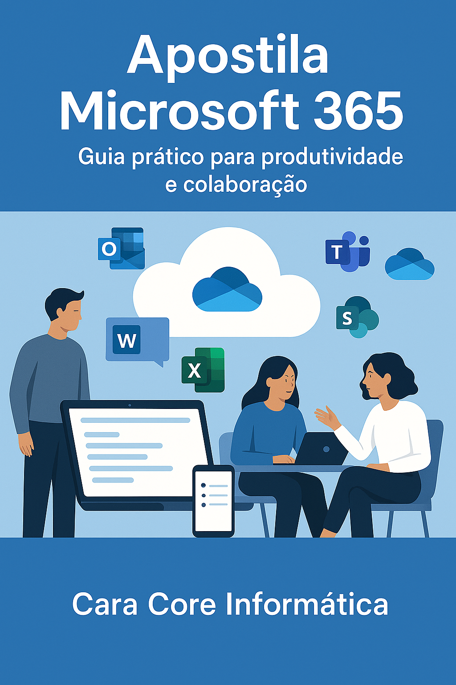
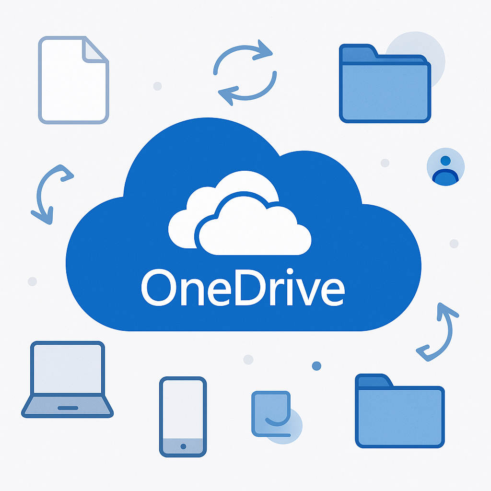
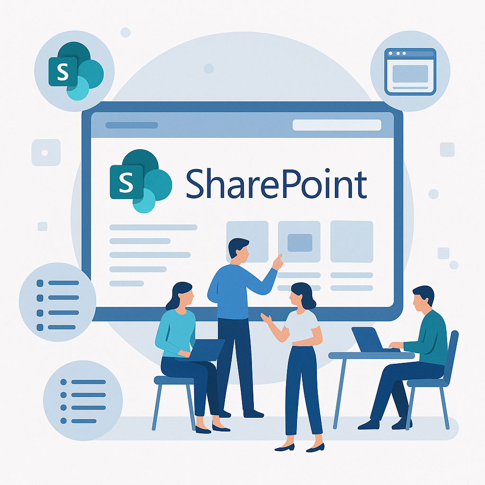

# Apostila Microsoft 365



**Cara Core Informática**  
**Versão:** v1.0 – 20 de Junho 2025  

***

## Sumário

- [Apostila Microsoft 365](#apostila-microsoft-365)
  - [Sumário](#sumário)
  - [1. Apresentação](#1-apresentação)
  - [2. Introdução ao Microsoft 365](#2-introdução-ao-microsoft-365)
    - [Definição do Microsoft 365 (antigo Office 365)](#definição-do-microsoft-365-antigo-office-365)
    - [Benefícios Principais](#benefícios-principais)
  - [3. Módulos dos Serviços](#3-módulos-dos-serviços)
    - [3.1 Outlook Online](#31-outlook-online)
    - [3.2 OneDrive](#32-onedrive)
    - [3.3 Word, Excel e PowerPoint Online](#33-word-excel-e-powerpoint-online)
    - [3.4 Microsoft Teams](#34-microsoft-teams)
    - [3.5 SharePoint](#35-sharepoint)
    - [3.6 Power Platform (Power Automate, Power Apps e Power BI)](#36-power-platform-power-automate-power-apps-e-power-bi)
    - [3.7 Segurança, Privacidade e Administração](#37-segurança-privacidade-e-administração)
  - [4. Boas Práticas e Produtividade](#4-boas-práticas-e-produtividade)
  - [5. Novidades e Atualizações](#5-novidades-e-atualizações)
  - [6. Referências e Links Úteis](#6-referências-e-links-úteis)
  - [7. Anexos](#7-anexos)
  - [Conclusão](#conclusão)
  - [Fale Conosco](#fale-conosco)
  - [Agradecimentos](#agradecimentos)
  - [Controle de Versões (ROADMAP)](#controle-de-versões-roadmap)
  - [Direitos Autorais e Isenção de Responsabilidade](#direitos-autorais-e-isenção-de-responsabilidade)

***

## 1. Apresentação

**Cara Core Informática** é uma empresa especializada em soluções de tecnologia, com foco em capacitação e suporte técnico.  
Esta apostila faz parte de nossa iniciativa de oferecer materiais educativos e práticos para usuários do Microsoft 365, facilitando o aprendizado e a utilização dos serviços da plataforma.

O objetivo deste material é capacitar usuários no uso dos principais serviços do Microsoft 365, apresentando conceitos, funcionalidades e boas práticas para o dia a dia profissional e pessoal.  
O conteúdo é destinado a profissionais, empresas e usuários que utilizam ou pretendem utilizar o Microsoft 365, independentemente do nível de conhecimento prévio.

A estrutura modular permite que o conteúdo seja consultado conforme a necessidade, com atualizações semestrais para acompanhar as novidades da plataforma.  
Para garantir acesso à versão mais recente, consulte sempre o site da Cara Core Informática.

Em caso de dúvidas, sugestões ou suporte, entre em contato pelo e-mail: [suporte@caracore.com.br], ou pelo Whatsapp: +55 41 99909-7797.

***
[Voltar ao Sumário](#sumário)

## 2. Introdução ao Microsoft 365

O Microsoft 365 é uma solução moderna que reúne aplicativos, serviços e recursos em nuvem para facilitar o trabalho, a colaboração e a comunicação em ambientes profissionais e pessoais. Neste capítulo, você vai entender o que é o Microsoft 365, seus principais benefícios e como ele pode transformar a rotina de empresas e usuários individuais.

### Definição do Microsoft 365 (antigo Office 365)

O Microsoft 365 é uma plataforma de produtividade baseada em nuvem desenvolvida pela Microsoft, que reúne um conjunto de aplicativos e serviços integrados para facilitar o trabalho, a colaboração e a comunicação em ambientes profissionais e pessoais.  
A solução inclui ferramentas como Outlook, Word, Excel, PowerPoint, OneDrive, Teams, SharePoint, entre outros, permitindo acesso seguro a arquivos, e-mails e recursos de qualquer lugar e dispositivo conectado à internet.  
Além dos aplicativos tradicionais, o Microsoft 365 oferece recursos avançados de segurança, gerenciamento e automação, tornando-se uma solução completa para empresas de todos os portes e para usuários individuais.

### Benefícios Principais

O Microsoft 365 oferece uma série de benefícios que tornam o trabalho mais produtivo, colaborativo e seguro, tanto para empresas quanto para usuários individuais. A seguir, destacamos os principais diferenciais da plataforma:

- **Acesso a aplicativos de produtividade online e offline**  
  Utilize Word, Excel, PowerPoint e Outlook tanto pela web quanto instalados no computador ou dispositivos móveis, garantindo flexibilidade para trabalhar em qualquer lugar.

- **Colaboração em tempo real com colegas e equipes**  
  Edite documentos simultaneamente, compartilhe arquivos e troque mensagens instantâneas, facilitando o trabalho em equipe e a comunicação eficiente.

- **Armazenamento seguro na nuvem com OneDrive**  
  Cada usuário possui espaço dedicado na nuvem para armazenar, acessar e compartilhar arquivos com segurança, com backup automático e controle de versões.

- **Integração entre aplicativos e serviços**  
  Os aplicativos do Microsoft 365 são integrados, permitindo, por exemplo, salvar arquivos do Outlook diretamente no OneDrive, agendar reuniões no Teams a partir do Outlook ou automatizar tarefas com o Power Automate.

Em resumo, o Microsoft 365 proporciona um ambiente moderno, seguro e integrado, que potencializa a produtividade e a colaboração, atendendo tanto às necessidades de usuários individuais quanto às demandas de empresas de todos os tamanhos.

***
[Voltar ao Sumário](#sumário)

## 3. Módulos dos Serviços

O Microsoft 365 é composto por diversos serviços e aplicativos que atendem a diferentes necessidades de produtividade, colaboração e gestão de informações.  
Nesta seção, apresentamos os principais módulos da plataforma, detalhando suas funcionalidades, formas de acesso e dicas de uso para que você aproveite ao máximo cada recurso.

### 3.1 Outlook Online

O Outlook Online é o serviço de e-mail, calendário e contatos do Microsoft 365, acessível diretamente pelo navegador. Ele permite gerenciar mensagens, compromissos e informações de contato de forma prática, integrada e segura, tanto para uso profissional quanto pessoal.

**Principais Recursos:**

- **Acesso via navegador:**  
  Basta acessar o portal do Microsoft 365 e fazer login para utilizar o Outlook Online em qualquer dispositivo conectado à internet.

- **Gestão de e-mails:**  
  Envie, receba e organize e-mails com facilidade. Crie pastas personalizadas, utilize categorias, marque mensagens importantes e aplique regras automáticas para organização.

- **Calendário integrado:**  
  Agende compromissos, reuniões e eventos. Compartilhe calendários com colegas e visualize agendas de equipe para facilitar o planejamento.

- **Contatos e grupos:**  
  Gerencie informações de contatos pessoais e profissionais. Crie grupos para facilitar o envio de mensagens em massa e a colaboração.

- **Colaboração e integração:**  
  Integração com Teams para agendamento de reuniões, compartilhamento de arquivos pelo OneDrive e colaboração em tempo real.

- **Personalização e produtividade:**  
  Personalize a interface com temas, organize pastas e utilize filtros avançados para localizar rapidamente mensagens e compromissos.

- **Segurança e privacidade:**  
  Recursos avançados de proteção de dados, autenticação multifator e políticas de privacidade para garantir a segurança das informações.

**Novidades recentes:**  
O Outlook Online recebe atualizações frequentes, incluindo melhorias na integração com Teams, busca aprimorada e novas opções de automação para facilitar o dia a dia.

***
[Voltar ao Sumário](#sumário)

### 3.2 OneDrive

O OneDrive é o serviço de armazenamento em nuvem do Microsoft 365, projetado para guardar, acessar e compartilhar arquivos de forma segura e prática, tanto no ambiente profissional quanto pessoal. Com ele, seus documentos, fotos e outros arquivos ficam disponíveis em qualquer dispositivo conectado à internet.



**Principais Recursos:**

- **Armazenamento na nuvem pessoal:**  
  Cada usuário possui um espaço dedicado para salvar arquivos, garantindo acesso rápido e seguro de qualquer lugar.

- **Upload, download e sincronização:**  
  Envie arquivos e pastas para a nuvem, faça download quando necessário e mantenha tudo sincronizado automaticamente entre computador, smartphone e web.

- **Compartilhamento e permissões:**  
  Compartilhe arquivos ou pastas com colegas, clientes ou familiares, definindo permissões de visualização ou edição conforme a necessidade.

- **Integração com desktop e mobile:**  
  O aplicativo do OneDrive está disponível para Windows, macOS, Android e iOS, permitindo acesso e edição de arquivos mesmo offline.

- **Colaboração em tempo real:**  
  Trabalhe em conjunto em documentos do Word, Excel e PowerPoint, com atualizações instantâneas e controle de versões.

- **Segurança e backup:**  
  Proteja seus dados com criptografia, autenticação multifator e recursos de backup automático, evitando perdas acidentais.

**Dica:**  
Utilize o OneDrive para centralizar seus arquivos importantes e facilitar o compartilhamento seguro com sua equipe ou clientes, mantendo sempre uma cópia de segurança na nuvem. 

***
[Voltar ao Sumário](#sumário)

### 3.3 Word, Excel e PowerPoint Online

O Word, Excel e PowerPoint Online são versões baseadas em nuvem dos aplicativos clássicos de produtividade da Microsoft. Eles permitem criar, editar e compartilhar documentos, planilhas e apresentações diretamente pelo navegador, sem necessidade de instalação.

**Principais Recursos:**

- **Acesso em qualquer lugar:**  
  Utilize os aplicativos pelo navegador em qualquer dispositivo conectado à internet, com seus arquivos salvos automaticamente no OneDrive.

- **Funcionalidades essenciais:**  
  Crie e edite textos, planilhas e apresentações com as principais ferramentas das versões desktop, incluindo formatação, gráficos, tabelas e imagens.

- **Colaboração em tempo real:**  
  Trabalhe simultaneamente com outras pessoas no mesmo arquivo, visualizando edições em tempo real e utilizando comentários para facilitar a comunicação.

- **Controle de versões:**  
  O histórico de versões permite recuperar alterações anteriores e acompanhar o desenvolvimento dos documentos.

- **Integração com outros serviços:**  
  Compartilhe arquivos facilmente pelo Teams, Outlook ou links do OneDrive, mantendo o fluxo de trabalho integrado.

**Diferenças entre web e desktop:**  
As versões online possuem recursos essenciais para a maioria das tarefas, mas algumas funções avançadas estão disponíveis apenas nas versões instaladas dos aplicativos.

**Dica:**  
Aproveite a colaboração em tempo real para projetos em grupo e utilize o OneDrive para manter seus arquivos sempre acessíveis e seguros.  

***
[Voltar ao Sumário](#sumário)

### 3.4 Microsoft Teams

O Microsoft Teams é a plataforma de comunicação e colaboração do Microsoft 365, projetada para integrar equipes, centralizar conversas, arquivos e ferramentas em um único ambiente digital. A seguir, veja como aproveitar ao máximo seus principais recursos:

**Criação de equipes e canais**  
No Teams, você pode criar equipes para diferentes departamentos, projetos ou grupos de trabalho. Dentro de cada equipe, é possível organizar canais temáticos para separar assuntos, tarefas ou áreas de interesse.

- Para criar uma equipe, clique em "Equipes" > "Criar equipe" e defina o nome, descrição e membros.
- Use canais padrão para discussões abertas e canais privados para conversas restritas a determinados membros.
- Personalize canais com guias, como arquivos, wikis e aplicativos.

**Chat, chamadas e reuniões**  
O Teams oferece chat individual e em grupo, além de chamadas de voz e vídeo, facilitando a comunicação rápida e eficiente.

- Utilize o chat para trocar mensagens instantâneas, compartilhar arquivos e reagir com emojis.
- Inicie chamadas de áudio ou vídeo diretamente do chat ou agende reuniões pelo calendário integrado.
- Durante reuniões, compartilhe tela, grave sessões e utilize recursos como quadro branco e salas de reunião separadas (breakout rooms).

**Compartilhamento de arquivos**  
Compartilhe documentos, imagens e outros arquivos diretamente nos chats ou canais.

- Arquivos enviados ficam armazenados no SharePoint (canais) ou OneDrive (chats), permitindo edição colaborativa em tempo real.
- Utilize o histórico de versões para recuperar alterações anteriores.
- Defina permissões de acesso conforme a necessidade do grupo.

**Integração com aplicativos**  
O Teams integra-se a diversos aplicativos do Microsoft 365 e de terceiros, centralizando ferramentas no fluxo de trabalho.

- Adicione guias de Word, Excel, Planner, OneNote, Power BI e outros diretamente nos canais.
- Explore o catálogo de aplicativos para automatizar tarefas, criar enquetes, gerenciar tarefas e muito mais.
- Use conectores para receber notificações de serviços externos (como Trello, GitHub, etc.).

**Novidades e melhorias**  
O Teams recebe atualizações frequentes, trazendo novos recursos e melhorias de desempenho.

- Recentemente, foram adicionados recursos como transcrição automática de reuniões, visualização dinâmica de participantes, reações ao vivo e integração aprimorada com o Outlook.
- Fique atento ao [roadmap oficial do Microsoft 365](https://www.microsoft.com/en-us/microsoft-365/roadmap) para acompanhar as novidades.

> **Dica:**  
> Utilize o Teams como hub central de colaboração, integrando comunicação, arquivos e aplicativos em um só lugar para aumentar a produtividade da equipe.

***
[Voltar ao Sumário](#sumário)

### 3.5 SharePoint

O SharePoint é a plataforma de colaboração e gestão de conteúdo do Microsoft 365, utilizada para criar sites, armazenar, organizar e compartilhar documentos, além de facilitar o trabalho em equipe em ambientes corporativos.

**O que é o SharePoint**  
O SharePoint permite criar portais, intranets, bibliotecas de documentos e áreas de colaboração para equipes, departamentos ou projetos. Ele centraliza informações, facilita o acesso a arquivos e integra-se com outros serviços do Microsoft 365, como Teams e OneDrive.



**Criação de sites e bibliotecas**  

- É possível criar sites de equipe para colaboração interna ou sites de comunicação para divulgação de informações.
- Cada site pode conter bibliotecas de documentos, listas, páginas e webparts personalizadas.
- Para criar um site, acesse o SharePoint pelo portal do Microsoft 365, clique em "Criar site" e escolha o tipo desejado.
- Bibliotecas de documentos permitem armazenar, organizar e controlar o acesso a arquivos de forma estruturada.

**Compartilhamento e organização de documentos**  

- Compartilhe arquivos e pastas com membros da equipe ou usuários externos, definindo permissões de leitura ou edição.
- Utilize metadados, colunas personalizadas e visualizações para organizar documentos e facilitar buscas.
- O controle de versões permite acompanhar alterações e restaurar versões anteriores de arquivos.
- Integração com o Teams e o OneDrive para colaboração em tempo real e acesso facilitado.

**Boas práticas**  

- Estruture sites e bibliotecas de acordo com a hierarquia e necessidades da organização.
- Defina permissões de acesso de forma criteriosa para proteger informações sensíveis.
- Utilize nomes claros e padronizados para arquivos e pastas.
- Aproveite recursos como alertas, fluxos de aprovação e automações com Power Automate para otimizar processos.
- Realize revisões periódicas para manter o conteúdo atualizado e relevante.

> **Dica:**  
> O SharePoint é ideal para centralizar documentos, criar portais internos e padronizar processos, promovendo colaboração e organização em equipes de todos os tamanhos.

***
[Voltar ao Sumário](#sumário)

### 3.6 Power Platform (Power Automate, Power Apps e Power BI)

A Power Platform é um conjunto de ferramentas do Microsoft 365 que permite automatizar processos, criar aplicativos personalizados e analisar dados de forma intuitiva, sem necessidade de conhecimentos avançados em programação. Ela é composta por três principais soluções: Power Automate, Power Apps e Power BI.

**Visão geral**  
A Power Platform integra-se aos demais serviços do Microsoft 365, facilitando a transformação digital nas organizações. Com ela, é possível automatizar tarefas repetitivas, criar soluções sob medida para necessidades específicas e obter insights a partir de dados, tudo de forma visual e acessível.

**Automatização de processos (Power Automate)**  
O Power Automate (antigo Microsoft Flow) permite criar fluxos de trabalho automáticos entre aplicativos e serviços, reduzindo tarefas manuais e aumentando a produtividade.

- Automatize notificações, aprovações, movimentação de arquivos e integração entre sistemas.
- Utilize modelos prontos ou crie fluxos personalizados com base em gatilhos e ações.
- Exemplo: Receber um alerta no Teams sempre que um novo arquivo for adicionado a uma pasta do OneDrive.

**Criação de aplicativos (Power Apps)**  
O Power Apps possibilita criar aplicativos personalizados para web e dispositivos móveis, sem necessidade de programação tradicional.

- Desenvolva soluções para coleta de dados, formulários, controle de inventário, registro de visitas, entre outros.
- Os aplicativos podem ser integrados ao SharePoint, Teams, Excel e outros serviços do Microsoft 365.
- Interface intuitiva com recursos de arrastar e soltar, facilitando a criação por usuários de negócio.

**Visualização de dados (Power BI)**  
O Power BI é a ferramenta de análise e visualização de dados da Microsoft, permitindo criar dashboards interativos e relatórios dinâmicos.

- Conecte-se a diversas fontes de dados, como Excel, SharePoint, bancos de dados e serviços em nuvem.
- Crie gráficos, tabelas e indicadores para acompanhar métricas e tomar decisões baseadas em dados.
- Compartilhe relatórios com a equipe pelo Teams, SharePoint ou publicando na web.

> **Dica:**  
> Explore a Power Platform para automatizar rotinas, criar soluções sob medida e transformar dados em informações valiosas, potencializando o uso do Microsoft 365 em sua organização.

***
[Voltar ao Sumário](#sumário)

### 3.7 Segurança, Privacidade e Administração

A segurança, privacidade e administração são pilares fundamentais no Microsoft 365, garantindo proteção de dados, conformidade com normas e gestão eficiente dos recursos da organização.


**Proteção de dados e compliance**
O Microsoft 365 oferece recursos avançados para proteger informações sensíveis e atender a requisitos legais e regulatórios (LGPD, GDPR, etc.).

- Ferramentas de prevenção contra perda de dados (DLP) para evitar vazamento de informações.
- Criptografia de dados em trânsito e em repouso.
- Auditoria e logs de atividades para rastreamento e conformidade.
- Políticas de retenção e classificação de dados.

**Backup e recuperação**  

- O Microsoft 365 mantém versões anteriores de arquivos no OneDrive e SharePoint, permitindo restaurar documentos em caso de exclusão ou alteração acidental.
- Recursos de recuperação de caixa de e-mail e itens excluídos no Outlook.
- Para necessidades avançadas, considere soluções de backup de terceiros integradas ao Microsoft 365.

**Gerenciamento de usuários e licenças**  

- O portal de administração permite criar, editar e remover usuários, além de atribuir licenças conforme a necessidade.
- Grupos de segurança e funções administrativas facilitam a delegação de permissões.
- Relatórios de uso e auditoria ajudam a monitorar o ambiente e otimizar recursos.

**MFA – Autenticação Multifator**  

- A autenticação multifator (MFA) adiciona uma camada extra de segurança, exigindo uma segunda forma de verificação além da senha.
- Pode ser ativada para todos os usuários ou grupos específicos, reduzindo riscos de acesso não autorizado.
- Suporta aplicativos autenticadores, SMS, chamadas telefônicas e notificações push.

**Políticas de segurança**  

- Defina políticas de senha forte, bloqueio de conta e acesso condicional.
- Utilize o Microsoft Defender para Office 365 para proteção contra ameaças, phishing e malware.
- Implemente políticas de acesso condicional para controlar o acesso com base em localização, dispositivo ou risco detectado.

> **Dica:**  
> Revise periodicamente as configurações de segurança e políticas de compliance para garantir que sua organização esteja protegida e em conformidade com as melhores práticas do mercado.

***
[Voltar ao Sumário](#sumário)

## 4. Boas Práticas e Produtividade

Adotar boas práticas no uso do Microsoft 365 potencializa a produtividade, facilita a colaboração e garante maior organização no dia a dia. Confira algumas dicas essenciais para aproveitar ao máximo os recursos da plataforma:

- **Organização do Outlook e OneDrive:**  
  Mantenha sua caixa de entrada limpa utilizando pastas, categorias e regras automáticas no Outlook. No OneDrive, organize seus arquivos em pastas temáticas e utilize nomes claros para facilitar buscas e compartilhamentos.

- **Gestão de tempo e tarefas no Teams e Outlook:**  
  Utilize o calendário do Outlook para agendar compromissos e reuniões. No Teams, crie tarefas e acompanhe o progresso em equipe, integrando com o Planner ou To Do para não perder prazos importantes.

- **Colaboração eficiente entre plataformas:**  
  Compartilhe documentos pelo OneDrive ou Teams, permitindo edição simultânea e comentários em tempo real. Use o chat do Teams para alinhar rapidamente decisões e evitar trocas excessivas de e-mails.

- **Integração entre aplicativos do M365:**  
  Aproveite a integração entre Word, Excel, PowerPoint, Outlook, Teams e OneDrive para automatizar rotinas, compartilhar arquivos com facilidade e centralizar informações, tornando o fluxo de trabalho mais ágil e conectado.

Adotar essas práticas contribui para um ambiente digital mais produtivo, colaborativo e seguro, otimizando o uso do Microsoft 365 em qualquer contexto profissional ou pessoal.

***
[Voltar ao Sumário](#sumário)

## 5. Novidades e Atualizações

Nesta seção, acompanhe as principais novidades e mudanças recentes no Microsoft 365, garantindo que você e sua equipe estejam sempre atualizados com os recursos mais modernos da plataforma.

**Resumo das atualizações mais recentes**  
O Microsoft 365 recebe atualizações constantes, trazendo melhorias de desempenho, segurança e novas funcionalidades para os aplicativos e serviços. Entre as novidades recentes, destacam-se:

- Integração aprimorada entre Teams, Outlook e OneDrive.
- Novos recursos de colaboração em tempo real nos aplicativos do Office Online.
- Melhorias em segurança, autenticação multifator e proteção contra ameaças.

**Funcionalidades novas relevantes**  

- Transcrição automática e legendas em tempo real nas reuniões do Teams.
- Novos templates e automações no Power Automate.
- Recursos de coautoria e comentários aprimorados no Word, Excel e PowerPoint Online.
- Dashboards interativos e conectores expandidos no Power BI.

**Mudanças na interface ou nas políticas**  

- Interface do Teams redesenhada para facilitar a navegação e o acesso rápido a chats, arquivos e reuniões.
- Atualizações nas políticas de privacidade e compliance, alinhadas à LGPD e GDPR.
- Novos controles de administração para gerenciamento de dispositivos e permissões.

**Links para roadmap e changelog oficial**  

- [Microsoft 365 Roadmap](https://www.microsoft.com/en-us/microsoft-365/roadmap): Acompanhe as próximas funcionalidades e lançamentos planejados.
- [Microsoft 365 Changelog](https://learn.microsoft.com/en-us/microsoft-365/roadmap?view=o365-worldwide): Veja o histórico detalhado de atualizações e melhorias.

> **Dica:**  
> Consulte regularmente o roadmap e o changelog oficial para planejar treinamentos, adoção de novos recursos e garantir que sua organização aproveite ao máximo as inovações do Microsoft 365.

***
[Voltar ao Sumário](#sumário)

## 6. Referências e Links Úteis

- [Microsoft 365 Roadmap](https://www.microsoft.com/en-us/microsoft-365/roadmap)  
- [Microsoft Learn](https://learn.microsoft.com/)  
- [Microsoft Tech Community](https://techcommunity.microsoft.com/)  
- [Central de Ajuda Microsoft 365](https://support.microsoft.com/)  
- [Canal oficial no YouTube](https://www.youtube.com/@Microsoft365)  

***
[Voltar ao Sumário](#sumário)

## 7. Anexos

Nesta seção, você encontra materiais complementares para facilitar o uso do Microsoft 365 no dia a dia. Utilize estes anexos para agilizar tarefas, padronizar processos e aumentar sua produtividade:

- **Tutoriais práticos:**  
  Passo a passo para as principais tarefas, como configurar o Outlook, compartilhar arquivos no OneDrive, criar reuniões no Teams, entre outros.

- **Checklists e Guias Rápidos:**  
  Listas de verificação para garantir que nenhum detalhe importante seja esquecido em processos recorrentes, além de guias resumidos para consulta rápida.

- **Modelos de documentos:**  
  Exemplos prontos de atas, apresentações, planilhas e outros arquivos úteis para uso imediato ou adaptação conforme a necessidade.

- **Checklists de produtividade:**  
  Ferramentas para organizar rotinas, priorizar tarefas e acompanhar o progresso das atividades, otimizando o tempo e os resultados.

> **Dica:**  
> Personalize os anexos conforme a realidade da sua equipe ou empresa para obter ainda mais benefícios do Microsoft 365. Utilize os modelos e checklists como base para criar processos eficientes e adaptados às suas necessidades específicas.

***
[Voltar ao Sumário](#sumário)

## Conclusão

Esta apostila é um guia introdutório para o Microsoft 365, cobrindo os principais serviços e funcionalidades. Para aprofundar seus conhecimentos, recomendamos explorar os links úteis e participar da comunidade Microsoft.
Acompanhe as atualizações semestrais para se manter informado sobre as novidades e melhorias contínuas da plataforma.

***
[Voltar ao Sumário](#sumário)

## Fale Conosco

Sua opinião é muito importante para nós!  

Se tiver dúvidas, sugestões, feedbacks ou quiser compartilhar sua experiência com o Microsoft 365, entre em contato pelos canais abaixo:

- **E-mail:** [suporte@caracore.com.br](mailto:suporte@caracore.com.br)
- **Whatsapp:** [+55 41 99909-7797](https://wa.me/5541999097797)
- **Site:** [www.caracore.com.br](https://www.caracore.com.br)
- **GitHub:** [caracore.com.br/cara-core](https://caracore.com.br/)
- **Facebook:** [facebook.com/caracoreinformatica](https://www.facebook.com/caracoreinformatica/)
- **LinkedIn:** [linkedin.com/company/cara-core](https://www.linkedin.com/company/cara-core)

Agradecemos por escolher a Cara Core Informática como sua parceira no aprendizado e uso do Microsoft 365.
Estamos à disposição para ajudar você.

***
[Voltar ao Sumário](#sumário)

## Agradecimentos

Agradecemos a todos os colaboradores e usuários que contribuíram para a criação desta apostila. Sua participação é fundamental para aprimorarmos continuamente nossos materiais e serviços.

***
[Voltar ao Sumário](#sumário)

## Controle de Versões (ROADMAP)

```markdown
|--------|------------|---------------------------------------------------------|
| Versão | Data       | Descrição das Alterações                                |
|--------|------------|---------------------------------------------------------|
| 1.0    | 20/06/2025 | Criação inicial                                         |
| 1.1    | 20/12/2025 | Revisão semestral: atualização de conteúdo e links      |
| 1.2    | 20/06/2026 | Inclusão de novos módulos e revisão geral               |
| 1.3    | 20/12/2026 | Atualização de práticas recomendadas e recursos novos   |
| 1.4    | 20/06/2027 | Revisão de segurança, privacidade e anexos              |
| 1.5    | 20/12/2027 | Atualização de imagens, exemplos e roadmap              |
|--------|------------|---------------------------------------------------------|
```

***
[Voltar ao Sumário](#sumário)

## Direitos Autorais e Isenção de Responsabilidade

Esta apostila é de propriedade da Cara Core Informática e está protegida por direitos autorais.
A reprodução, distribuição ou modificação deste material sem autorização prévia é proibida.

> **Nota:**  
> Esta apostila é um material educativo e de apoio ao usuário. A Cara Core Informática não possui vínculo comercial com a Microsoft, nem representa oficialmente a marca ou seus produtos. Todas as marcas, nomes e logotipos Microsoft 365 mencionados pertencem à Microsoft Corporation. Nosso papel é exclusivamente prestar suporte, treinamento e orientação para o melhor uso das soluções Microsoft por nossos clientes e parceiros.

