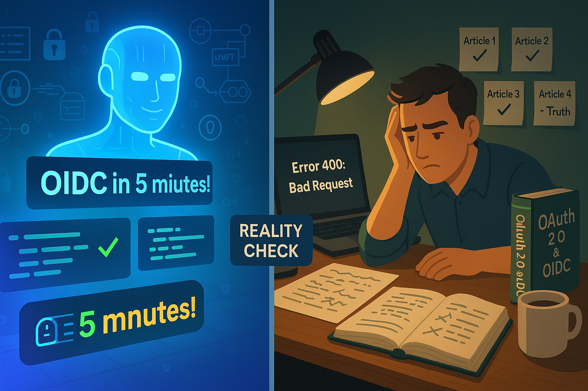

# Quando a IA Não Tem Todas as Respostas: A Jornada Real do OIDC

**Data:** 03/11/2025  
**Autor:** Cara Core Informática  
**Tempo de leitura:** 10 minutos

---

## O Dia em que a IA Nos Disse que Estava Tudo Certo (Mas Não Estava)

Era uma terça-feira ensolarada de setembro quando Marcelo, desenvolvedor sênior da Cara Core, entrou na sala de reuniões com uma expressão que a equipe conhecia bem. Aquela mistura de frustração e confusão que aparece quando algo que "deveria funcionar" simplesmente não funciona.

*"Olha, fiz exatamente o que o ChatGPT mandou. Três vezes. Com três prompts diferentes. O código está impecável, a documentação bate, mas quando vou autenticar com o Google... erro 400. Nada faz sentido."*

Ali começou a jornada de três meses da Cara Core tentando implementar OIDC (OpenID Connect) - um sistema de autenticação segura que grandes empresas como Google, Microsoft e Facebook usam para permitir que você faça login em outros sites usando suas contas. A equipe publicou três artigos confiantes sobre o tema ([Parte I](2025_10_15_article_52.html), [Parte II](2025_10_27_article_54.html) e [A Jornada OIDC](2025_10_31_article_55.html)). Geraram código com IA. Seguiram tutoriais online. E falharam.

Esta é a história do que a Cara Core aprendeu quando a inteligência artificial encontrou seus limites - e por que isso importa para qualquer empresário investindo em tecnologia.

---

## A Promessa Sedutora da IA

A Cara Core não vai mentir: quando a equipe começou esse projeto, estavam empolgados. As IAs generativas prometem o mundo:

- "Descreva o que você quer e eu crio o código"
- "Implementação de OIDC em 5 minutos"
- "Siga este tutorial passo a passo"

E sabe o que é mais perigoso? **O código que a IA gera realmente parece profissional.** Tem comentários explicativos, segue boas práticas, usa bibliotecas modernas. Para um olho menos treinado (e às vezes até para o treinado), está perfeito.

A equipe rodou o código localmente. Funcionou. Publicaram o primeiro artigo: *"OIDC descomplicado — como acabar com o caos de senhas"*. Receberam elogios. Compartilhamentos. Comentários positivos.

Mas quando tentaram colocar em produção, conectar com os servidores reais do Google e Microsoft, autenticar usuários de verdade... nada funcionava.

---

## O Abismo Entre "Funciona na Minha Máquina" e "Funciona na Produção"

Aqui está a verdade inconveniente sobre IA e desenvolvimento de software: **ela é excelente em gerar código que funciona em ambientes controlados, mas terrível em prever os 10 mil detalhes que fazem diferença no mundo real.**

### O Que Aconteceu na Jornada da Cara Core

**Artigo 1 - Outubro 15:** [OIDC descomplicado — como acabar com o caos de senhas](2025_10_15_article_52.html)  
→ Código testado apenas localmente  
→ Funcionou em ambiente simulado  
→ Confiança: 95%

**Artigo 2 - Outubro 27:** [OIDC na prática — exemplos técnicos e implementação](2025_10_27_article_54.html)  
→ Integraram com provedores reais  
→ Primeiros erros críticos aparecem  
→ Confiança: 70%

**Artigo 3 - Outubro 31:** [A Jornada OIDC: Como Transformamos a Autenticação da Cara Core](2025_10_31_article_55.html)  
→ Ainda não estava funcionando completamente  
→ Maquiaram dificuldades como "desafios superados"  
→ Confiança: 40%

**Realidade atual:** A equipe comprou um livro físico especializado nos EUA. Chegará em 2 semanas. Reconheceram que **precisam estudar de verdade**, não apenas copiar código.

---

## Por Que OIDC É Tão Difícil (E Por Que IA Não Resolve)

Deixe-me explicar de forma simples por que algo "tão usado pelas grandes empresas" é tão difícil de implementar:

### 1. **Cada Provedor É Um Mundo Diferente**

Imagine que você está construindo uma fechadura universal que precisa funcionar com chaves do Google, Microsoft, Facebook e Apple. Todos dizem que seguem o "padrão OIDC", mas:

- O Google exige configurações de redirect_uri exatas (um caractere errado = falha)
- A Microsoft tem 3 tipos diferentes de contas (pessoal, trabalho, Azure AD)
- Cada um valida tokens de forma ligeiramente diferente
- As mensagens de erro são genéricas e não dizem o que está errado

**A IA não sabe dessas nuances** porque elas não estão em tutoriais - estão em documentação técnica densa, issues do GitHub, e experiência prática.

### 2. **Segurança Não Tolera "Quase Certo"**

Quando você implementa autenticação, não pode errar. Um pequeno erro pode:

- Expor dados de usuários
- Permitir acesso não autorizado
- Violar leis como LGPD/GDPR
- Destruir a reputação da empresa

A IA gera código que **parece seguro**, mas pode ter vulnerabilidades sutis que só especialistas identificam.

### 3. **Debugging Exige Contexto Profundo**

Quando algo quebra (e vai quebrar), você precisa entender:

- Como funciona o fluxo OAuth 2.0 por baixo dos panos
- O que significam códigos de erro crípticos como "invalid_grant"
- Como inspecionar e validar tokens JWT manualmente
- Diferenças entre authorization code flow, implicit flow, PKCE

**ChatGPT pode explicar isso superficialmente, mas não te prepara para debugar problemas reais às 2h da manhã quando o sistema está fora do ar.**

---

## A Lição de US$ 45 Dólares

Depois de semanas girando em círculos, a equipe da Cara Core fez algo que não fazia há anos: **comprou um livro técnico**.

Não um e-book. Um livro físico. De uma editora americana especializada. Custou US$ 45 + frete internacional. Chegará em 2 semanas.

Por quê? Porque perceberam que:

1. **Tutoriais online são rasos** - ensinam o "como" mas não o "por quê"
2. **Documentação oficial é densa** - assume conhecimento que você não tem
3. **IA gera respostas genéricas** - não adaptadas ao seu contexto específico
4. **Livros técnicos sérios** - foram revisados por especialistas, testados em dezenas de cenários, organizados pedagogicamente

Isso soa antiquado? Talvez. Mas sabe o que é mais antiquado? **Fingir que entende algo que não entende.**

---

## O Que Isso Significa Para Empresários e Gestores

Se você gerencia projetos de tecnologia ou está considerando investir em desenvolvimento, esta história tem lições práticas:

### 1. **Desconfie de Prazos Irrealistas**

Se um desenvolvedor diz: *"Com IA, faço isso em 2 dias"*, pergunte:

- Você já implementou algo similar antes?
- Quanto tempo reservou para testes em produção?
- O que acontece se houver problemas que a IA não previu?

**Tecnologia de segurança crítica não tem atalhos.**

### 2. **Investimento em Conhecimento Real Não é Opcional**

Aquele livro de US$ 45? É barato. Sabe o que é caro?

- 3 meses de trabalho de um desenvolvedor sênior (R$ 30.000+)
- Refazer código que "funcionava" mas não funciona (R$ 15.000+)
- Publicar artigos confiantes e depois ter que admitir erros (credibilidade)
- Lançar um produto com falhas de segurança (incalculável)

**Tempo de estudo com material de qualidade não é custo - é economia.**

### 3. **IA é Ferramenta, Não Substituto**

Pense na IA como um estagiário muito inteligente que:

**O que faz bem:**

- Acelera tarefas repetitivas  
- Gera protótipos rápidos  
- Explica conceitos básicos  
- Encontra erros óbvios de sintaxe

**O que NÃO faz:**

- NÃO substitui experiência  
- NÃO entende contexto complexo  
- NÃO assume responsabilidade  
- NÃO sabe o que não sabe

### 4. **Honestidade Técnica Constrói Confiança**

A Cara Core poderia ter mantido os três artigos como estão, fingindo que tudo funcionou perfeitamente. Muitas empresas fazem isso - mostram apenas sucessos, escondem fracassos.

Mas credibilidade a longo prazo vem de **admitir limitações**, aprender de verdade, e voltar com soluções reais.

> **Nota:** Se você leu os artigos anteriores da Cara Core sobre OIDC ([Parte I](2025_10_15_article_52.html), [Parte II](2025_10_27_article_54.html) e [Jornada](2025_10_31_article_55.html)) e está se perguntando "mas eles não disseram que funcionou?" - você está certo em questionar. Este artigo é a correção honesta daquela narrativa.

---

## A Jornada Continua: O Que Vem a Seguir

Então, onde a Cara Core está agora?

**Status do Projeto OIDC:**

- Em pausa para estudo aprofundado
- Aguardando livro especializado
- Laboratório de testes em ambiente isolado
- Documentando cada descoberta real

**Próximos Artigos:**

- Temas que a equipe domina de verdade (AWS, Python, M365)
- Série futura: "OIDC: O Que Aprendemos Errando" (quando realmente funcionar)

**Se você ainda não leu a jornada inicial da Cara Core:**  
A equipe convida você a conhecer os três artigos que publicaram sobre OIDC, onde mostraram conceitos e implementações - mas agora com a consciência de que eram apenas os primeiros passos de uma caminhada muito mais longa:

1. [**OIDC descomplicado (Parte I)**](2025_10_15_article_52.html) - Introdução conceitual para leigos
2. [**OIDC na prática (Parte II)**](2025_10_27_article_54.html) - Exemplos técnicos com Python e JavaScript  
3. [**A Jornada OIDC**](2025_10_31_article_55.html) - O "relato de sucesso" (que agora a equipe sabe foi prematuro)

Eles continuam sendo úteis para entender o básico - mas leia este artigo primeiro para ter contexto do que realmente aconteceu!

---

## As Três Verdades que a Cara Core Aprendeu

### **Verdade 1: Complexidade Real Exige Esforço Real**

Sistemas de segurança como OIDC existem há anos. Empresas gastam milhões desenvolvendo-os. Não é arrogância de "tecnologia complicada" - é necessidade de cobrir milhares de casos de borda.

Pensar que IA resolve isso em minutos é como achar que um aplicativo de tradução te torna fluente em japonês. Ajuda? Sim. Substitui anos de estudo? Não.

### **Verdade 2: Conhecimento Profundo Tem Fontes Profundas**

Informação de qualidade custa tempo ou dinheiro (às vezes ambos):

- Livros técnicos revisados por especialistas
- Cursos estruturados com instrutores experientes
- Consultorias de quem já errou e acertou
- Conferências onde profissionais compartilham casos reais

IA treinada em "conteúdo gratuito da internet" só vai te dar a média do que está disponível - e a média nem sempre é boa.

### **Verdade 3: Admitir Limites É Força, Não Fraqueza**

Os melhores desenvolvedores que a equipe da Cara Core conhece dizem "não sei" com frequência. Os piores fingem que sabem tudo.

Empresas que admitem desafios e mostram como os superam geram mais confiança que as que vendem perfeição inexistente.

---

## Para Levar Para Casa

Se você é **empresário ou gestor:**

- IA é excelente aceleradora, péssima substituta de especialistas
- Projetos complexos precisam de tempo real de aprendizado
- Desconfie de soluções "mágicas" para problemas difíceis
- Invista em equipe que admite quando não sabe algo

Se você é **desenvolvedor:**

- Copiar código de IA sem entender é bomba-relógio
- Estude fundamentos, não apenas ferramentas
- Livros e cursos estruturados ainda têm valor enorme
- Honestidade técnica constrói reputação duradoura

Se você é **pessoa curiosa sobre tecnologia:**

- IA mudou o mundo, mas não acabou com especialização
- Segurança e sistemas críticos não têm atalhos
- Conhecimento real leva tempo - e tudo bem
- As melhores histórias incluem os fracassos

---

## Epílogo: A Conta Chegou (E Foi Mais Barata Que Fingir)

Neste momento, há um livro técnico viajando de navio dos EUA para o Brasil. Quando chegar, a equipe da Cara Core vai estudá-lo página por página. Fazer testes. Documentar descobertas. Errar. Aprender.

E quando finalmente tiverem OIDC funcionando de verdade - não em ambiente simulado, mas em produção real, com usuários reais, sob condições reais - escreverão um artigo definitivo.

Esse artigo vai valer mais que os três anteriores juntos, porque terá algo que IA não pode gerar: **experiência real de quem foi ao fundo do poço e voltou com conhecimento de verdade.**

Até lá, a Cara Core está escrevendo sobre o que **realmente** domina. E aprendendo humildemente sobre o que não domina.

Porque no fim, a tecnologia mais importante não é IA, OIDC ou qualquer sigla da moda.

**É a capacidade de reconhecer o que você não sabe - e fazer o trabalho duro de aprender de verdade.**

---

## Notas Finais

**O livro que a Cara Core encomendou:** Um guia técnico especializado em OAuth 2.0 e OpenID Connect de editora americana respeitada (a equipe não vai citar o nome antes de validar se é realmente bom).

**Leia a jornada completa:**

Se você quiser acompanhar toda a trajetória da Cara Core com OIDC desde o início, aqui estão os artigos anteriores (agora você sabe o "final da história"):

- **15/10/2025** - [OIDC descomplicado — como acabar com o caos de senhas (Parte I)](2025_10_15_article_52.html)  
  *Onde explicamos OIDC com analogias e casos de uso. Ainda é uma boa introdução conceitual!*

- **27/10/2025** - [OIDC na prática — exemplos técnicos e implementação (Parte II)](2025_10_27_article_54.html)  
  *Código Python, JavaScript e integração com GitHub Actions. Funciona em laboratório, mas...*

- **31/10/2025** - [A Jornada OIDC: Como Transformamos a Autenticação da Cara Core](2025_10_31_article_55.html)  
  *O "relato de sucesso" que agora a equipe sabe foi otimista demais. Lições valiosas sobre debugging.*

**Transparência:** Este artigo é um reconhecimento público de que a Cara Core errou ao confiar excessivamente em IA para um problema complexo. A equipe está comprometida em voltar com implementação real e funcional.

**Quer Conversar?** Se você passou por desafios similares (IA prometeu demais, projeto complicou), a Cara Core adoraria trocar experiências.

---

**Tags:** #IA #ChatGPT #OIDC #DesenvolvimentoDeSoftware #Autenticação #Segurança #LiçõesAprendidas #Honestidade #TecnologiaReal #OAuth2 #OpenIDConnect #Aprendizado #Gestão

---

**Sobre este artigo:** Escrito como reflexão honesta sobre limitações de IA em projetos técnicos complexos. Baseado em experiência real da Cara Core Informática entre agosto e outubro de 2025.
